# Designing an Enterprise Execution Platform for AI Agents

**Revision: v5**

AI agents are moving from conversational assistants toward software actors that perform work on behalf of employees: querying internal systems, modifying tickets, reviewing code, executing scripts, operating cloud infrastructure, and coordinating workflows that may span hours or days.

Selecting an agent framework—LangGraph, Claude Agent SDK, OpenAI Agents SDK, Google ADK, Microsoft Agent Framework, or a custom loop—is an application-level choice. The platform problem is broader: **how does an enterprise support a heterogeneous ecosystem of agent clients and harnesses without making every harness part of the Trusted Computing Base (TCB)?**

An organization should assume that agents will be invoked through multiple entry points: ChatGPT Enterprise, Claude, IDE extensions, internal applications, CI/CD pipelines, and other agents. Those agents need access to systems such as GitHub, Slack, Jira, databases, cloud APIs, internal services, and specialized subagents.

The design objective is **enterprise agent governance**:

> For every consequential action, the organization should be able to establish which human or service initiated the work, which agent acted, which run the action belonged to, what authority was available to that run, which implementation and policy versions were in force, and what external side effect occurred.

The architecture in this article treats model reasoning and harness logic as replaceable application code. Identity, delegation, execution durability, tool authorization, credential custody, isolation, and evidence collection are platform responsibilities.

The proposal uses established security and distributed-systems primitives where possible. It does not assume that a single standard currently defines an enterprise agent runtime.

---

## Executive summary: invariants cheat sheet

The full document is a reference specification. Teams implementing the first production stage should be able to keep the following shorter view open while building. The central architectural choice is that **the harness proposes; trusted platform components authorize, allocate, constrain, and record**.

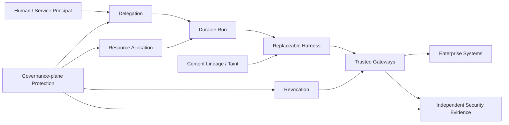

| Invariant | Authoritative owner | Required property |
| --- | --- | --- |
| Harness non-expansion | Governance policy + gateways | Prompts, skills, models, memory, and subagents cannot enlarge run authority. |
| Credential isolation | STS / credential broker | Reusable enterprise credentials never enter model context or arbitrary harness/sandbox code. |
| Side-effect authorization | MCP Gateway / trusted PEP | Consequential actions are authorized at the non-bypassable gateway at execution time. |
| Revocation | Revocation Controller + gateways | Once revocation is effective at the enforcement plane, new governed side effects for that scope are denied. |
| Resource containment | Resource Allocation Service + Run Governor | Descendants cannot double-spend, mint, or exceed the resource envelope delegated by ancestors. |
| Durable execution | Workflow engine | Run lifetime is independent of worker lifetime; durability does not grant authority. |
| Content trust | Content-lineage / declassification services | Untrusted content does not become trusted merely through summarization or model transformation. |
| Side-effect ambiguity | Side-Effect Ledger | Ambiguous external outcomes remain explicit as `UNKNOWN` until reconciled, compensated, or reviewed. |
| Governance-root protection | Privileged administration + HSM/KMS + independent evidence | Governance services and signing authority are themselves access-controlled, dual-controlled where required, key-protected, and independently evidenced. |
| Evidence independence | Security evidence plane | Selected high-risk operations can depend on evidence acknowledgement from a security domain independent of the harness and runtime. |

A useful implementation rule is: **for every invariant, name the authoritative state owner, the enforcement point, the maximum permitted staleness, and the fail-safe behavior when dependencies are unavailable.**

---

## 1. Goals, assumptions, and non-goals

The platform is designed for an enterprise in which many teams can build or invoke agents and where more than one model provider or harness will be used.

### Goals

The platform should provide:

- a first-class identity for each governed agent;
- preservation of the initiating human or service identity;
- least-privilege delegation bounded by both user and agent policy;
- centralized tool discovery and authorization;
- credentials that are not exposed to prompts, arbitrary harness code, or sandboxes;
- execution that survives laptop shutdowns, process crashes, deployments, and long waits;
- bounded code execution for agents that require shells, browsers, or interpreters;
- signed and attributable agent and skill artifacts;
- explicit controls for subagent delegation;
- human approval for policy-defined sensitive operations;
- reconstructable evidence for consequential side effects.

### Non-goals

The platform should not prescribe:

- a reasoning algorithm;
- a prompt format;
- ReAct versus planning;
- single-agent versus multi-agent orchestration;
- a memory or context-compaction strategy;
- a particular model vendor;
- a single agent framework.

Those decisions belong to the harness implementation and will change more quickly than enterprise security and execution infrastructure.

---

## 2. Reference architecture and separation of concerns

A useful starting point is to separate the agent's reasoning loop from the infrastructure that gives an execution identity, authority, durability, resource bounds, governed access to external systems, content trust context, and reconstructable evidence.

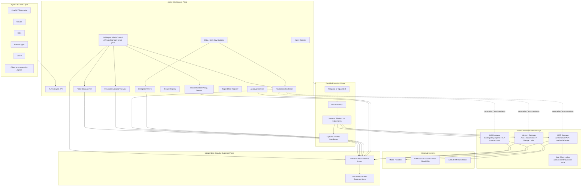

The detailed diagram intentionally distinguishes several kinds of control. The executive-summary diagram above is the conceptual view; this diagram shows the concrete trusted services and data paths.

- the **Agent Governance Plane** owns durable governance state such as registered identities, delegation, revocation state, policy, tenant context, approvals, authoritative resource allocation, and protected administrative/key-management functions;
- the **Durable Execution Plane** owns run lifecycle and local enforcement of a resource envelope, but it does not grant authority to itself;
- the **trusted gateways** are the reference monitors for consequential model, tool, and memory operations;
- the **Side-Effect Ledger** records mutation intent and ambiguous outcomes at the trusted tool boundary;
- the **Independent Security Evidence Plane** has failure semantics that can differ from ordinary operational telemetry.

Anthropic has publicly described a related decomposition for long-running hosted agents: a durable **session**, a replaceable **harness**, and a separately provisioned **sandbox**. The important idea is the interface boundary, not the vendor-specific implementation.[1]

### Domain definitions

**Agent definition**  
A registered enterprise asset describing an agent's owner, approved implementation, risk classification, allowed models, capability ceiling, skills, subagents, and operational limits.

**Harness**  
Application code implementing model interaction and reasoning: context construction, model calls, tool selection, compaction, planning, subagent orchestration, and termination logic. The harness is replaceable application code rather than a trusted authorization component.

**Run**  
One globally unique execution of an agent against a particular objective. A run carries an initiating principal, agent identity, tenant context, policy context, delegation ceiling, resource envelope, lineage context, and lifecycle state.

**Runtime**  
Infrastructure that provides durable orchestration, workload identity, isolation, scheduling, quotas, local resource enforcement, and interaction with trusted enforcement services.

**Run Governor**  
An execution-plane enforcement component that consumes a resource envelope issued by the governance plane and enforces rate, concurrency, depth, runtime, and other local ceilings. It may decrease available resources through consumption but cannot enlarge the envelope.

**Resource Allocation Service**  
The authoritative governance-plane owner for consumable resource accounting. It performs atomic reservations, parent/child allocation, usage settlement, and reclaim. It is the source of truth when several child runs allocate resources concurrently.

**Revocation Controller**  
The authoritative owner of revocation state and revocation epochs. It distributes changes to trusted enforcement points and supports reconciliation after missed events or partitions.

**Artifact**  
A unit of content that can influence execution, including a document, tool result, retrieved memory object, model-generated summary, uploaded file, or extracted structured value. Governed artifacts carry provenance, classification, integrity, and content-trust metadata.

**Side-Effect Ledger**  
An ACID-backed record at the trusted tool boundary that persists mutation intent before dispatch and records known, failed, or ambiguous external outcomes.

**Sandbox**  
An optional disposable execution environment for untrusted or model-generated code. A sandbox is not required for agents that operate exclusively through typed tools.

---

## 3. Threat model and security invariants

The design assumes that a harness may make incorrect or adversarial decisions.

Possible causes include:

- direct prompt injection;
- indirect prompt injection through documents, tickets, web pages, tool output, or memory;
- malicious or compromised skills;
- model errors;
- vulnerable harness dependencies;
- arbitrary code generated by the model;
- compromised external content stored in long-term memory;
- runaway loops, recursive subagent spawning, or denial-of-wallet behavior;
- stale authorization state during long-running execution;
- compromise or misuse of a trusted governance-plane service, privileged administrator, signing key, or policy-management path;
- supply-chain compromise of governance-plane components that issue tokens, revocations, resource allocations, approvals, or declassification decisions.

The platform therefore uses a reference-monitor pattern.

> **The harness may request an action. A trusted enforcement point determines whether the action is allowed.**

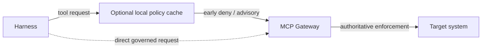

The local evaluator is an optimization. The gateway is the boundary.

The system is designed around the following invariants.

### Invariant 1: a harness cannot grant itself authority

Loading a new prompt, skill, model, memory object, tool result, or subagent must never expand the authorization ceiling of the current run.

### Invariant 2: enterprise credentials remain outside the reasoning environment

Long-lived OAuth refresh tokens, API keys, cloud credentials, browser session cookies, and similar credentials should not be exposed to the model context, sandbox, or arbitrary harness code.

### Invariant 3: security-critical authorization is enforced at the gateway

A local policy sidecar may reject requests early or cache policy data for latency reasons. It is not sufficient as the only enforcement point if the harness can communicate directly with the gateway.

The MCP gateway must either evaluate the relevant authorization decision itself or verify a short-lived, cryptographically protected authorization decision produced by a trusted policy service.

### Invariant 4: authorization is checked at side-effect time

A run may last for hours or days. During that time a user may leave a group, an agent may be disabled, a repository may become protected, or policy may change.

The run's delegation establishes an upper bound, but security-sensitive tool calls should be re-evaluated against current policy when they execute.

```text
run delegation      = maximum authority granted when the run was created
live authorization  = current permission to execute this specific action
```

A run can therefore lose authority while it is still active.

### Invariant 5: revocation is enforced at the trusted enforcement plane

Workflow or activity cancellation is not the security boundary.

```text
workflow cancellation = stop logical execution
activity cancellation = best-effort stop of in-flight computation
gateway revocation     = prevent new governed side effects
```

The security guarantee is:

> **After revocation becomes effective at the enforcement plane, no new governed side effect may be authorized for the revoked scope.**

Revocation may target a run, agent, agent version, skill digest, principal, tenant, tool, policy version, or the entire platform.

### Invariant 6: resource authority cannot be double-spent or expanded by descendants

Capabilities are not the only attenuating quantity. A run also receives a bounded resource envelope.

For a consumable budget \(B_r\):

\[
\operatorname{Spend}(\operatorname{subtree}(r)) \le B_r
\]

and child reservation must satisfy:

\[
B_{child,reserved} \le B_{parent,available}
\]

Reservations that modify shared parent capacity must be atomic at the authoritative Resource Allocation Service. A Run Governor may enforce an issued envelope but cannot mint additional budget.

### Invariant 7: untrusted content cannot become trusted merely by passing through an LLM

Every governed content artifact carries source and trust metadata. Derived content conservatively inherits the highest applicable taint of its inputs unless a trusted declassification operation explicitly lowers it.

A summary of an untrusted document is therefore not automatically trusted.

### Invariant 8: selected high-risk side effects depend on independent security evidence

Operational telemetry and security evidence are distinct paths. Policy may require durable acknowledgement of authorization and mutation intent by the independent evidence plane before a selected high-risk side effect is dispatched.

### Invariant 9: governance authority is itself governed

The Agent Governance Plane is part of the TCB and is therefore a high-value compromise target. Administrative access to the STS, Revocation Controller, Resource Allocation Service, policy system, Approval Service, or Declassification Service must not be treated as ordinary application administration.

High-impact governance changes should use strong workload/admin identity, least privilege, separation of duties or dual control where appropriate, protected signing-key custody, and independently emitted security evidence. A single compromised harness must not be able to become a governance administrator, and a single ordinary platform administrator should not silently be able to mint arbitrary enterprise authority without leaving independently governed evidence.

---

## 4. Identity and delegation

The platform needs to distinguish at least three identities:

```text
human or calling service
agent
runtime workload
```

They answer different questions.

A multi-tenant deployment also carries a trusted **tenant context**. Tenant is not a fourth actor identity; it is a security partition derived from authenticated identity or trusted routing state and used to namespace policy, credentials, resource accounting, memory, and evidence. It must not be accepted as an arbitrary harness-supplied field.

The human identity answers **who initiated or approved the work?**

The agent identity answers **which governed software actor is operating?**

The workload identity answers **which running process is presenting this request?**

Microsoft's Entra Agent ID is evidence that this distinction is becoming a first-class enterprise identity problem. Microsoft now represents agent identities separately and supports delegated scenarios in which the access token subject is the user while the actor identifies the agent.[2]

### 4.1 Human authentication: OIDC; API authorization: OAuth

OpenID Connect is appropriate for authenticating interactive users to clients and control-plane applications.

OAuth access tokens protect APIs.

It is useful to keep those roles explicit rather than referring to an "OIDC-protected REST API." The REST API normally accepts OAuth access tokens whose human authentication may have originated from an OIDC sign-in flow.

### 4.2 Workload identity with SPIFFE/SPIRE

A Kubernetes service account or cloud-native workload identity may be sufficient in a single-cloud deployment. SPIFFE provides a vendor-neutral model when workloads span clusters or environments.

SPIFFE SVIDs provide short-lived cryptographic workload identity. SPIRE can determine which identity to issue using workload and node attestation selectors.[3]

An SVID establishes the identity of a workload according to the configured trust and attestation rules. It does **not** by itself prove that the workload binary is untampered or that the process is executing on confidential hardware. Binary provenance and hardware attestation require separate controls.

A harness worker may therefore present:

```text
workload identity:
  spiffe://corp.example/agents/github-pr-reviewer

run context:
  user  = alice
  agent = github-pr-reviewer
  run   = run-991823ab
```

### 4.3 Delegated authority with OAuth 2.0 Token Exchange

RFC 8693 defines OAuth 2.0 Token Exchange. It supports a `subject_token`, an optional `actor_token`, requested scopes and target resources, and defines the JWT `act` claim for expressing an acting party.[4]

This makes it a useful building block for user-plus-agent delegation.

A conceptual request could be:

```http
POST /oauth/token
Content-Type: application/x-www-form-urlencoded

grant_type=urn:ietf:params:oauth:grant-type:token-exchange
&subject_token=<alice-access-token>
&subject_token_type=urn:ietf:params:oauth:token-type:access_token
&actor_token=<agent-workload-assertion>
&actor_token_type=urn:ietf:params:oauth:token-type:jwt
&resource=https://mcp.corp.example/github
&scope=github.pull.read github.pull.comment
```

The authorization server can issue an audience-restricted, short-lived token representing Alice as the subject and the PR-review agent as the actor.

```json
{
  "iss": "https://identity.corp.example",
  "sub": "alice@corp.example",
  "act": {
    "sub": "spiffe://corp.example/agents/github-pr-reviewer"
  },
  "aud": "https://mcp.corp.example/github",
  "exp": 1786125600,
  "scope": "github.pull.read github.pull.comment",
  "run_id": "run-991823ab",
  "tenant_id": "engineering",
  "security_epoch": 193,
  "resource_constraints": {
    "github.repository": "engineering/payments",
    "github.pull_request": 842
  }
}
```

Two qualifications matter.

First, RFC 8693 supplies the exchange mechanism; it does not automatically implement least-privilege attenuation. The authorization server and resource server must define and enforce how requested scope, user entitlement, agent policy, resource constraints, and current policy interact.

Second, fields such as `run_id`, `tenant_id`, `security_epoch`, and `resource_constraints` are deployment-specific claims. They are useful if every receiving enforcement point has defined semantics for them; they are not standardized by RFC 8693.

### 4.4 Capability attenuation

A useful authorization invariant is:

\[
A_{effective} \subseteq A_{human} \cap A_{agent} \cap A_{run}
\]

The notation is intentionally a subset relation rather than an equality. A resource server may apply additional restrictions based on current resource state, environmental policy, approval requirements, risk, or downstream platform rules.

For example:

```text
Alice:
  read repo A
  merge repo A
  administer repo A

PRReviewAgent:
  read repository
  comment on pull request

Run 991823ab:
  repository = A
  pull request = 842

Effective request ceiling:
  read PR 842
  comment on PR 842
```

### 4.5 Specialized agents for sensitive roles

Some authority should not be delegated to a general-purpose assistant even if the user possesses it.

Production deployment is an example.

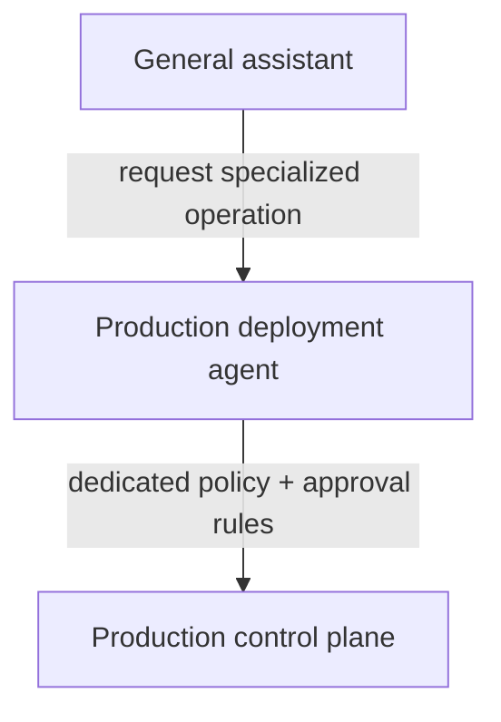

The specialized agent has its own identity, owner, implementation, allowed tools, and risk controls.

This creates a separation-of-duties boundary and limits the effect of a compromised general assistant.

### 4.6 Sender-constrained tokens

Short lifetimes reduce token exposure but do not prevent replay during the token's validity period.

OAuth Security Best Current Practice recommends sender-constrained and audience-restricted access tokens where practical. Standard mechanisms include mutual-TLS certificate-bound tokens and DPoP.[5]

For a server-side runtime, mTLS binding to workload-held key material is a natural option. DPoP is another option when application-layer proof-of-possession is operationally easier.

The relevant property is:

```text
stolen access token alone != usable credential
```

---

## 5. MCP gateway and enterprise tool plane

The MCP gateway is the primary enforcement point for tool use.

Its responsibilities include:

- tool and server discovery;
- client authentication;
- authorization;
- resource and argument constraints;
- credential brokerage;
- revocation and authorization-freshness enforcement;
- rate limits and quotas;
- approval obligations;
- request and response policy;
- durable side-effect intent for mutating operations;
- audit evidence;
- routing to connector executors or MCP servers.

### 5.1 Enterprise-managed MCP authorization

The MCP Enterprise-Managed Authorization extension became stable in June 2026. It allows an enterprise identity provider to become the centralized authority for MCP-server access instead of requiring a separate user authorization flow for each server.[6]

That is useful for server-level discovery and access.

It is not, by itself, a complete policy model for individual agent actions. The enterprise platform still needs to evaluate questions such as:

```text
Can this agent, in this run, acting for this principal,
invoke this tool against this resource with these arguments now?
```

The MCP project also notes that extension support is client-dependent, so the platform should not require every client to implement the extension before it can participate.[7]

A managed client may use the extension directly. Other clients can enter through the enterprise agent API and let the platform handle tool authorization internally.

### 5.2 Gateway registry metadata

The tool registry should include governance metadata rather than only schemas and URLs.

```yaml
tool: github.pull.merge
classification: write
risk: high

allowed_agent_classes:
  - repository-maintainer
  - release-manager

constraints:
  protected_branch:
    approval_required: true

authorization:
  freshness_class: high-risk-write

idempotency:
  ledger_required: true
  downstream_mode: downstream-key

evidence:
  mode: PRECOMMIT_REQUIRED
  payload_policy: hash-and-short-retention
```

This lets discovery and enforcement use the same catalog.

### 5.3 Credential brokerage

The harness should invoke logical tools, not obtain the corresponding downstream credential.

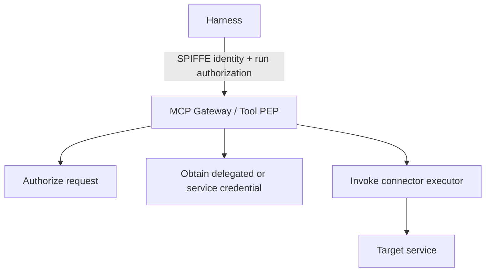

A generic secrets manager may store certain credentials, but OAuth refresh-token custody and token minting are better treated as a credential-broker or security-token-service responsibility.

The ephemeral downstream access token should normally be visible only to the connector executor that needs it.

---

## 6. The agent governance plane

Agents should be registered services rather than anonymous processes. The governance plane owns durable control state that must not depend on a harness worker remaining alive.

It should answer:

```text
Which agents exist?
Who owns and sponsors each one?
Which implementation versions are approved?
Who may invoke an agent?
Which tools and skills can it use?
Which models may it call?
What risk class does it belong to?
What execution and spending limits apply?
Which tenant owns this run?
Which runs are currently active?
Which runs, agents, skills, or principals are revoked?
```

A registry entry might look like:

```yaml
id: production-incident-investigator
owner: sre-platform
risk_class: medium

implementation:
  image: registry.corp/agents/incident-investigator@sha256:...

allowed_models:
  - confidential-general

skills:
  - corp://skills/kubernetes-diagnostics@sha256:...
  - corp://skills/incident-process@sha256:...

tools:
  - kubernetes.read
  - datadog.query
  - pagerduty.read

subagents:
  - log-investigator
  - change-correlator

limits:
  max_runtime: 4h
  max_llm_budget_usd: 25
  max_tool_calls_per_minute: 10
  max_active_children: 3
  max_delegation_depth: 3
```

### 6.1 Stable run API

The runtime should expose a harness-independent API.

```http
POST /v1/agents/{agent_id}/runs
GET  /v1/runs/{run_id}
POST /v1/runs/{run_id}/signals
POST /v1/runs/{run_id}/cancel
GET  /v1/runs/{run_id}/events
```

A create request contains the objective and input context:

```json
{
  "objective": "Review pull request 842",
  "input": {
    "repository": "engineering/payments",
    "pull_request": 842
  },
  "constraints": {
    "max_execution_time_seconds": 7200,
    "max_budget_usd": 5
  }
}
```

The caller authenticates to the API using the normal Authorization header. The control plane obtains the caller identity and trusted tenant context from the verified access token and performs token exchange or delegation internally.

The API should **not** require callers to place raw delegation tokens inside JSON request bodies; those payloads are more likely to be copied into application logs and traces.

The server should resolve the approved agent version by policy. An explicit version can be supported for testing or controlled rollback, but an arbitrary client should not be able to select an unapproved historical version.

### 6.2 Protocol adapters

REST or gRPC can remain the canonical lifecycle API.

Other interfaces can adapt to it:

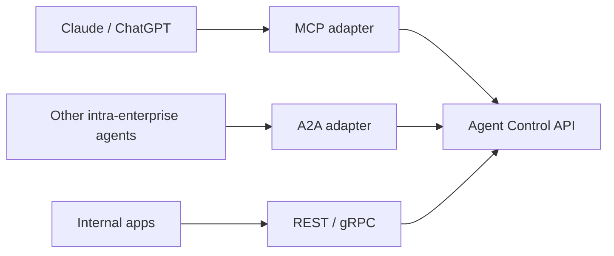

An MCP adapter might expose:

```text
agents.list
agents.describe
agents.run
agents.status
agents.signal
agents.cancel
```

This keeps MCP useful for ergonomic agent-to-agent discovery without making the internal lifecycle model depend on MCP.

The A2A adapter described here assumes agents within the same enterprise trust and identity domain. Cross-organization agent delegation requires explicit federation, trust translation, capability mapping, and per-hop re-issuance and is outside the initial architecture.

### 6.3 Resource allocation and run governance

The Resource Allocation Service and Run Governor have deliberately different responsibilities.

```text
Resource Allocation Service = authoritative accounting and reservation
Run Governor                = enforcement of an already-issued envelope
```

The governance plane issues a resource vector such as:

```yaml
resources:
  consumable:
    usd_budget: 25
    llm_tokens: 2000000
    tool_calls: 1000
    sandbox_cpu_seconds: 3600
    egress_bytes: 1000000000

  structural:
    max_tool_calls_per_minute: 10
    max_active_children: 3
    max_total_children: 10
    max_delegation_depth: 3

  deadlines:
    run_deadline: 2026-08-08T16:00:00Z
```

These dimensions have different semantics.

**Consumable resources** use reservation, metering, settlement, and reclaim.

**Structural limits** are hard non-expandable ceilings such as delegation depth or maximum concurrency.

**Deadlines** stop or suspend further work when reached, but policy may permit an explicit governance action to extend them. The harness cannot extend its own deadline.

The resource vector is extensible. Deployments may add dimensions such as GPU time, browser minutes, database-query units, or tenant-specific service credits. New dimensions must declare whether they are consumable, structural, or deadline-like and must preserve the same non-expansion, atomic-reservation, trusted-metering, and settlement rules.

#### Atomic child reservations

If several children are created concurrently, parent capacity is shared mutable state. The reservation check must therefore be serialized or atomically conditional at the Resource Allocation Service.

A useful accounting invariant is:

\[
AllocatedChildren(r) + SpendDirect(r) + Available(r) = B_r
\]

A child reservation succeeds only if sufficient parent capacity remains at commit time.

#### Dynamic reclaim

When a child reaches a terminal state such as `COMPLETED`, `FAILED`, `CANCELLED`, or `TIMED_OUT`, terminal usage settlement must release unused reserved capacity back to the parent's available pool:

\[
B_{unused}=B_{reserved}-B_{consumed}
\]

The authoritative settlement transaction should atomically close or settle the child's reservation and durably credit `B_unused` to `B_parent,available`. Notification of the new balance to sibling Run Governors may be asynchronous, but the credit itself must become authoritative immediately after settlement so sibling allocations do not suffer artificial budget starvation.

For example, if a parent reserves `$10` for a child and trusted metering records `$2` consumed at completion, settlement credits the remaining `$8` back to the parent's available allocation pool. Repeated settlement or reclaim requests must be idempotent.

Consumption is based on trusted metering, not on a child harness self-report.

#### Exhaustion states

Budget or quota exhaustion is a lifecycle condition rather than merely a billing alert.

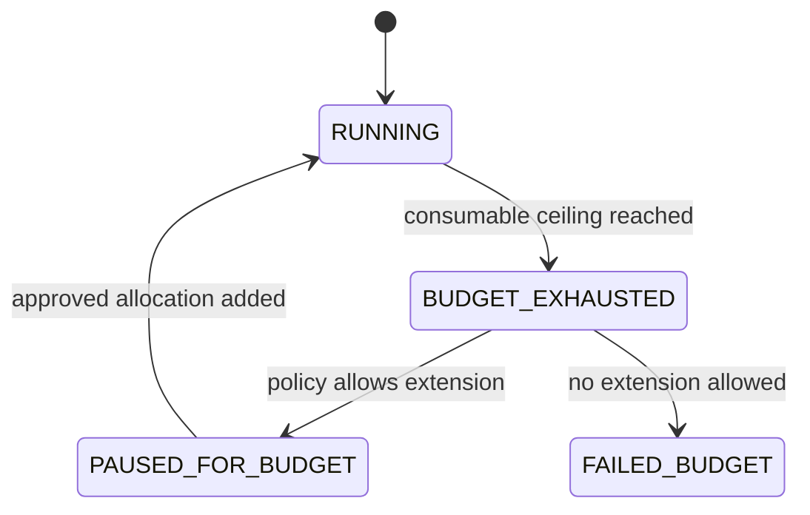

### 6.4 Revocation controller and epochs

The Revocation Controller owns authoritative revocation state. Useful scopes include:

```text
run_id
agent_id
agent_version
skill_digest
principal_id
tenant_id
tool_id
policy_version
global
```

A deployment may maintain monotonic values such as:

```text
security_epoch
tenant_policy_epoch
agent_revocation_epoch
```

Short-lived delegated tokens or authorization assertions can record the epoch under which they were issued. A gateway rejects an assertion when its applicable epoch is older than authoritative revocation state.

A reference distribution design uses both streaming push and authoritative reconciliation:

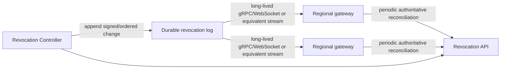

Gateways should maintain a long-lived streaming subscription to the revocation distribution path. The transport is an implementation choice—gRPC streaming, WebSocket, managed pub/sub, or an equivalent ordered fanout—but the security contract is not: push minimizes latency while reconciliation repairs missed events, gateway restarts, stream gaps, and recovery after partitions.

Each trusted gateway should track at least its last applied epoch, last successful stream receipt, and last successful authoritative reconciliation. If connectivity to authoritative revocation state is lost long enough that the gateway's security state exceeds the operation's maximum staleness SLO, the gateway automatically degrades to a fail-closed posture for new evaluations that require fresher state. A stale local cache cannot be used to manufacture a new `ALLOW` after its bounded validity expires.

Reference defaults might be:

```text
high-risk write:
  cached ALLOW prohibited; live authoritative state required

normal write:
  maximum revocation-state age <= 30 seconds

sensitive read:
  maximum revocation-state age <= 60 seconds

low-risk read:
  deployment-policy-defined bounded cache
```

The numbers are deployment defaults that can be tightened. The high-risk-write rule is an invariant rather than a tuning suggestion.

### 6.5 Governance-plane self-protection

The governance plane is a trust root, not an ordinary collection of internal microservices. Compromise of the STS signing path, Revocation Controller, Resource Allocation Service, policy-management system, Approval Service, or Declassification Service could otherwise create apparently valid tokens, epochs, budgets, approvals, or trust labels that downstream gateways would accept.

A reference protection model should include:

- **strong administrative identity and just-in-time privilege** rather than broad standing administrator roles;
- **separation of duties / four-eyes control** for high-impact changes such as trust-root rotation, global revocation rollback, policy bypass, emergency resource expansion, declassification-policy changes, or creation of privileged agent classes;
- **HSM- or managed-KMS-backed custody** for STS signing keys, epoch-signing keys, and other keys whose compromise would let an attacker forge trusted governance assertions;
- **short-lived service credentials and workload identity** between governance services, with explicit service-to-service authorization rather than implicit network trust;
- **signed and versioned policy/configuration artifacts** with controlled promotion into authoritative environments;
- **independent evidence emission** for privileged governance actions, including token-signing-key rotation, policy publication, revocation changes, resource-limit overrides, approval-policy changes, and declassification-policy changes;
- **break-glass procedures** that are narrow, time-bounded, strongly authenticated, and separately evidenced rather than an undocumented bypass path.

Governance services should not share a single unrestricted administrator credential or common signing key merely for convenience. Where practical, compromise domains should be separated so that control of one service does not automatically imply control of every governance function.

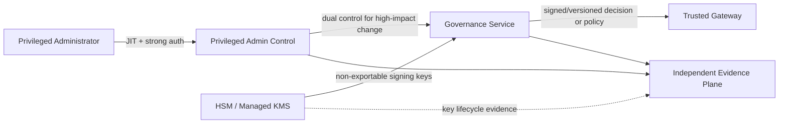

The independent evidence plane should be administered under a security domain that is not reducible to the same application-admin path used to modify the governance service producing the event. This does not make governance compromise impossible, but it raises the number of independently controlled boundaries an attacker must defeat and preserves evidence for investigation.

---

## 7. Durable execution: Kubernetes plus a workflow engine

Kubernetes and Temporal solve different problems.

### Kubernetes provides the compute plane

- worker scheduling;
- autoscaling;
- workload identity integration;
- resource limits;
- network policy;
- runtime classes;
- pod and node isolation.

### Temporal provides the logical execution lifecycle

- durable workflow state;
- activity retries;
- timers;
- external signals;
- long waits;
- cancellation;
- recovery after worker failure.

The core invariant is:

\[
\text{Run lifetime} \ne \text{Worker process lifetime}
\]

Temporal describes Activities as the boundary for unreliable or non-deterministic operations and automatically retries them when configured to do so.[8]

The workflow engine owns durable progression. It does not own the platform's authorization, revocation, credential, or resource-allocation authority.

### 7.1 Do not execute arbitrary harness logic as deterministic workflow code

Temporal workflow code is replayed and must obey deterministic execution rules. LLM calls, external network calls, and arbitrary agent-framework operations are non-deterministic.

A practical design is to keep the Temporal workflow small and use Activities for externally observable work.

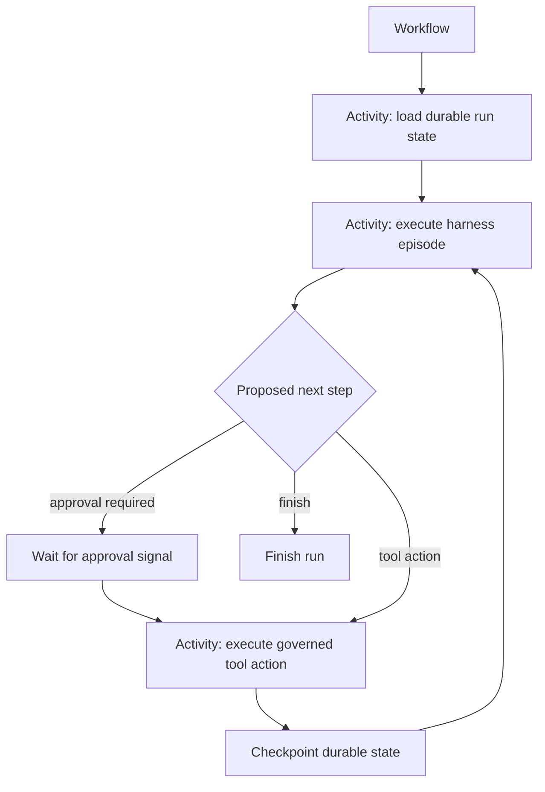

The exact granularity is a design trade-off. A framework that already supports resumable checkpoints may run several agent turns inside one Activity. The workflow should still persist enough state to recover without assuming that a particular worker survives.

### 7.2 Run Governor

The Run Governor enforces the resource envelope issued by the governance plane. It is not the authoritative allocator.

Typical responsibilities include:

- rejecting tool or model requests after the run's consumable allocation is exhausted;
- limiting tool-call rate;
- limiting active child runs;
- enforcing delegation depth;
- bounding sandbox concurrency;
- suspending work at policy-defined deadlines;
- reporting trusted usage to the Resource Allocation Service.

The Run Governor must fail closed with respect to enlargement: if it cannot validate its current envelope, it must not assume additional resources are available.

### 7.3 Temporal history is not the model's memory database

Temporal's event history should contain workflow state and references required for durable replay. Large prompts, artifacts, tool outputs, and model transcripts belong in external object or session storage with hashes and durable references recorded in workflow state.

The platform should configure an inline-payload threshold materially below the workflow engine's hard limit. Payloads above that threshold are written to governed artifact storage and represented in workflow history by integrity-protected durable references.

Long-running workflows also need a history-management strategy such as Continue-As-New or an equivalent rollover pattern.

### 7.4 Session state and model context are separate

The authoritative session may contain thousands of events while the model sees only a projection:

```text
model context =
    current objective
  + selected recent events
  + retrieved historical events
  + compacted summaries
  + authorized artifacts
  + content-trust metadata or derived policy obligations
```

Compaction modifies the model's view, not the canonical evidence or session state.

This separation also permits model or harness migrations without destroying the run history.

---

## 8. External side effects, idempotency, and the Side-Effect Ledger

This is one of the most important distributed-systems boundaries in the platform.

Consider:

```text
1. tool request reaches Slack
2. Slack commits the message
3. worker loses the response or crashes
4. workflow engine retries the Activity
```

The workflow engine cannot know from the network failure alone whether the external side effect occurred. Side-effecting Activities must therefore be designed to tolerate repeated execution or to enter an explicit reconciliation path.

### 8.1 Stable action identity

The runtime assigns a globally stable `tool_call_id` before execution. The trusted MCP/connector boundary persists the mutation intent before the downstream call.

The authoritative Side-Effect Ledger can store:

```text
(tenant_id, run_id, tool_call_id)
request_hash
tool
resource
idempotency_key
attempt
state
downstream_operation_id
response_hash
timestamps
```

The ledger should be ACID-capable because concurrent retries or duplicate submissions must not create multiple independent mutation intents for the same stable action identity.

### 8.2 Side-effect state machine

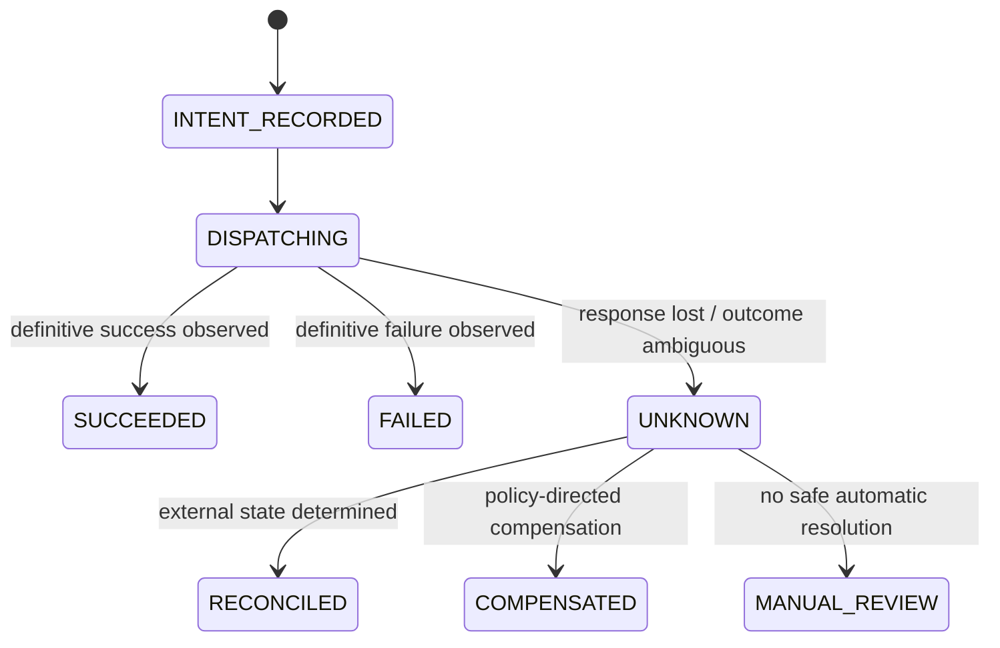

`UNKNOWN` is a first-class outcome. `PENDING` or `DISPATCHING` must not be interpreted automatically as safe to retry after an ambiguous network failure.

### 8.3 Downstream-specific retry semantics

If the downstream API supports idempotency keys, the connector should reuse the same stable key on every retry.

```http
Idempotency-Key: call_019283...
```

This provides the semantics offered by that downstream API. It should not be described generically as a two-phase commit or as a guarantee of exactly-once execution.

For APIs without idempotency support, the connector needs a tool-specific strategy:

- read-after-write reconciliation;
- externally visible operation IDs;
- compare-and-set semantics;
- deduplication in an intermediary system;
- compensation;
- human or operator reconciliation;
- or an explicit acceptance of at-least-once behavior.

The tool registry should advertise those semantics so harness developers and reviewers know what a retry can mean.

### 8.4 Evidence linkage

The Side-Effect Ledger and security evidence plane serve different purposes. The ledger is the authoritative operational record used to make retry and reconciliation decisions; the evidence plane preserves independently governed security evidence about the intent, authorization, approval, dispatch, and observed result.

---

## 9. Sandbox isolation for generated code

Not every agent needs arbitrary code execution.

A Slack or Jira automation that operates entirely through typed tools may require no sandbox at all.

Agents that execute model-generated shell commands, Python, downloaded packages, browsers, or user-supplied code require a stronger isolation boundary.

The isolation mechanism should be selected based on risk rather than fixed globally.

```text
low risk:
  typed tools only

moderate risk:
  hardened container / gVisor-style sandbox

high risk or multi-tenant arbitrary code:
  hardware-virtualized sandbox such as Kata or dedicated microVM
```

Kata Containers is designed to combine container orchestration with hardware-virtualized isolation and supports several hypervisors, including Firecracker.[10]

The architecture should therefore depend on a sandbox interface rather than on a particular hypervisor.

```text
provision(profile) -> sandbox_id
execute(sandbox_id, command) -> result
snapshot(sandbox_id) -> artifact_ref
destroy(sandbox_id)
```

### Sandbox policy

A high-risk sandbox should generally have:

- no reusable user or agent credentials;
- no cloud-instance metadata access;
- no direct route to internal control-plane services;
- bounded CPU, memory, disk, and execution time;
- controlled egress through a policy-aware proxy;
- ephemeral root filesystems where feasible;
- explicit artifact export rather than arbitrary host mounts.

Anthropic has described the same structural goal in its hosted agent architecture: generated code executes in an environment where sensitive credentials are not reachable, while authenticated external actions pass through a separate proxy or vault-backed tool path.[1]

---

## 10. Content lineage, taint, and memory governance

Untrusted content can affect an agent within a single run and can also persist across runs. A malicious ticket, web page, document, tool result, or retrieved memory object can influence the model's next decision even when the content is not itself executable code.

The platform should therefore govern **artifacts**, not only long-term memory objects.

### 10.1 Artifact provenance and content trust

A governed artifact can record:

```json
{
  "artifact_id": "artifact_881a2",
  "payload_hash": "sha256:...",
  "source": "github://engineering/payments/issues/391",
  "source_type": "tool-output",
  "source_run_id": "run_991823ab",
  "ingesting_agent": "incident-investigator:v14",
  "initiating_principal": "alice@corp.example",
  "classification": "internal",
  "acl": ["group:engineering"],
  "source_trust": "external-untrusted",
  "taint": "high",
  "derived_from": [],
  "ingested_at": "2026-08-08T12:00:00Z"
}
```

A hash establishes content integrity relative to a known payload; it does not establish provenance by itself.

If cryptographically verifiable provenance is required, the ingestion service should sign or attest the metadata record, or anchor it in the audit/evidence system.

### 10.2 Conservative taint propagation

A default information-flow rule is:

\[
T_{derived} \ge \max(T_{input_1}, \ldots, T_{input_n})
\]

A model-generated summary of high-taint content is therefore still high-taint unless a trusted declassification operation lowers it.

Taint is not an authorization grant or denial by itself. It is policy input that can affect:

- context presentation and isolation;
- model guardrails;
- autonomous write eligibility;
- approval obligations;
- memory promotion eligibility;
- evidence requirements;
- whether derived content may cross trust or tenant boundaries.

### 10.3 Declassification is a privileged, action-bound transformation

Declassification is the deliberate lowering of an artifact's content-trust level. It must not be a general harness capability such as `mark_trusted()`.

A declassification record should bind the decision to specific input and output artifacts:

```json
{
  "declassification_id": "decl_01928",
  "input_artifact": "artifact_881",
  "input_hash": "sha256:...",
  "output_artifact": "artifact_992",
  "output_hash": "sha256:...",
  "from_taint": "high",
  "to_taint": "low",
  "method": "schema_extract",
  "policy": "content-declassification-v7",
  "reason": "extract invoice_number only",
  "run_id": "run_991823ab",
  "authorized_by": "policy:deterministic-extractor",
  "time": "2026-08-08T12:10:00Z"
}
```

The rule is:

> **Declassification authority applies to a specific transformation of specific content, not to arbitrary future artifacts.**

Two broad mechanisms are useful, with deterministic declassification preferred whenever the desired output can be expressed as a narrow structured transformation.

**Deterministic declassification is the primary automated path.** It may be permitted without human approval when a policy-approved, versioned transformation has tightly bounded semantics and cannot pass arbitrary free text through. Examples include extracting an ISO date, UUID, invoice number, enumerated status, or schema-validated JSON field using a strict parser, regular expression with bounded output, or JSON-schema-constrained extractor. The output must be materially narrower than the input and the transformation itself must be registered and evidenced.

This mechanism is intended to prevent cascading approval fatigue: an extended run should not require repeated human review merely to reuse small structured facts that can be deterministically isolated from high-taint context.

**Judgment-based declassification** is reserved for unstructured or semantic conclusions that cannot be established by a deterministic bounded transformation. It must be authorized by a principal holding a policy-defined declassification role (for example a designated data steward or security reviewer) or by a registered specialized review service with its own workload identity, narrow capability ceiling, and explicit declassification policy. The harness whose output is being reviewed cannot authorize its own declassification. Higher-impact trust-boundary changes may additionally require dual control.

The declassification event receives evidence treatment comparable to an approval because it changes future security decisions.

### 10.4 Authorization at retrieval time

Retrieval should pass through a Memory Gateway that applies current access policy before vector or keyword results are returned to the harness.

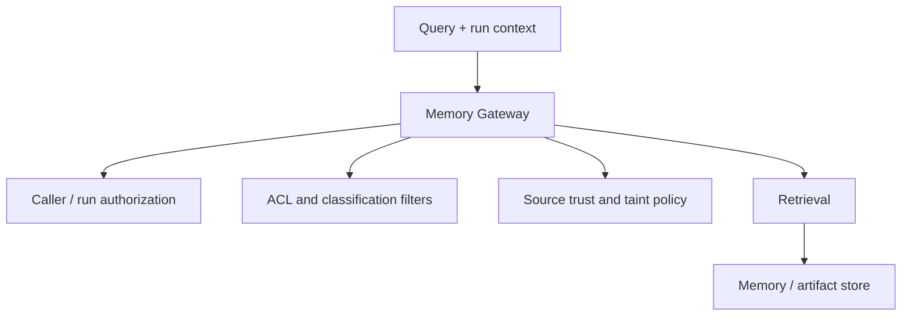

The vector database is an implementation detail rather than the security boundary.

### 10.5 Memory promotion is governed ingestion

Run-local state should not automatically become organization-wide memory.

Promotion to reusable memory can require policy based on:

- source and taint;
- data classification;
- owner;
- tenant;
- retention period;
- review status;
- allowed downstream purposes.

Deleting or quarantining the original source should also make it possible to identify derived memory through lineage so that affected artifacts can be re-evaluated, quarantined, or invalidated.

---

## 11. Skill packages and supply-chain governance

Skills are reusable instructional or executable artifacts: prompts, procedures, scripts, schemas, templates, and reference material.

They should be managed independently from agents.

```text
skill = reusable content or procedure
agent = governed actor with identity and execution policy
```

OCI registries are a reasonable distribution mechanism because OCI 1.1 explicitly supports artifacts other than container images.[11]

Sigstore/Cosign can provide artifact signatures and verification bundles containing the signing certificate, timestamp, and transparency-log inclusion proof.[12]

A skill manifest might contain:

```yaml
schema_version: v1

metadata:
  name: sre/kubernetes-diagnostics
  version: 2.1.0
  digest: sha256:...

publisher:
  team: sre-platform

capabilities:
  required:
    - kubernetes.pod.read
    - kubernetes.logs.read
  optional:
    - datadog.query

execution:
  sandbox_required: true

provenance:
  sigstore_bundle: bundle.sigstore.json
```

### Capability non-expansion

A skill declaration is a compatibility requirement, not an authorization grant.

```text
run has:
  kubernetes.pod.read

skill requires:
  kubernetes.pod.read
  kubernetes.pod.delete
```

The runtime does not grant `kubernetes.pod.delete` because the skill requested it.

Required capabilities outside the run's authority should normally make the skill ineligible for that run. Optional capabilities may be omitted.

The relevant invariant is:

\[
A_{after\ skill\ load} \subseteq A_{before\ skill\ load}
\]

The same rule applies to subagents.


### Skill restriction policy

A signed skill package may include a machine-readable restriction policy, including a Rego/OPA-compatible bundle if the enterprise chooses that mechanism. Its semantics must be subtractive only.

A useful decision form is:

\[
Allow = PlatformPolicy \land AgentPolicy \land RunDelegation \land SkillRestriction
\]

The skill restriction may narrow where or how the skill is used. It must never be combined as an additive `OR` that permits a skill to grant authority unavailable to the agent or run.

---

## 12. LLM gateway and model policy

Model-provider access is a separate control plane from tool authorization.

An LLM gateway can enforce:

- approved providers and models;
- data-classification policy;
- region and residency requirements;
- logging and retention rules;
- rate and cost budgets;
- model fallback policy;
- input/output scanning;
- secret and PII detection;
- prompt-injection heuristics.

The request context might include:

```text
agent = incident-investigator
run = run-991823ab
tenant = engineering
data_classification = confidential
content_taint = high
security_epoch = 193
purpose = production-incident
```

The gateway maps that context to an allowed model policy. Content-trust metadata can tighten model, tool-autonomy, or approval policy, but it does not replace the MCP gateway's independent authorization decision.

Guardrails remain defense in depth. A classifier that fails to detect prompt injection must not permit the harness to perform an unauthorized tool action, because the MCP gateway independently evaluates the action.

---

## 13. Human approval as an action-bound authorization grant

High-risk operations may require a human approval obligation.

A common mistake is to resume the run using the approver's fresh OAuth token. That changes the principal context of the whole run and can unintentionally increase the authority available to subsequent actions.

Approval should instead be specific to the pending operation.

```text
pending action:
  run = run-991823ab
  tool = kubernetes.deployment.restart
  resource = payments/prod/api
  args_hash = sha256:...
```

The approval service authenticates the human approver and produces a short-lived approval grant bound to those fields.

```json
{
  "run_id": "run-991823ab",
  "tool_call_id": "call_3821",
  "action_hash": "sha256:...",
  "approver": "alice@corp.example",
  "decision": "approve",
  "expires_at": "2026-08-08T13:15:00Z"
}
```

Execution resumes only if:

1. the original run delegation is still valid;
2. current policy still permits the action subject to approval;
3. the approver is currently authorized to approve it;
4. the action and arguments still match the approved hash;
5. the approval has not expired or been consumed;
6. applicable revocation and authorization-freshness requirements are satisfied.

Changing the target resource or arguments invalidates the approval.

### 13.1 Approval operations at scale

Action binding does not require every low-level operation to create a poor human experience. Policy can define constrained approval grants that remain narrower than session-wide authority.

For example:

```yaml
approval_grant:
  agent: github-pr-reviewer
  run: run-991823ab
  tool: github.pull.comment
  repository: engineering/payments
  max_uses: 10
  expires_in: 15m
  argument_constraints:
    pull_request: 842
```

Such a grant is still an attenuation object. It does not replace the run's principal token or authorize unrelated actions.

The approval service should also support policy-defined:

- backup approver groups;
- separation-of-duty rules;
- escalation on timeout;
- explicit approval deadlines;
- clear resource and argument diffs;
- bounded batch approval where risk policy permits it.

Timeout should default to fail closed for operations that require approval.

---

## 14. Independent evidence and audit architecture

The platform needs security evidence beyond ordinary application logs. The evidence path should be independently governed so that compromise of a harness or worker cannot suppress the records needed to reconstruct consequential actions.

For a consequential action, reviewers should be able to reconstruct:

```text
initiating principal
agent and implementation version
run identity
tenant
skill versions
model-policy decision
content-lineage context when relevant
requested tool and arguments
policy decision and version
revocation / authorization epoch
human approval or declassification, if any
side-effect-ledger identity
external result
```

### 14.1 CloudEvents as an event envelope

CloudEvents is useful as a vendor-neutral event format. Its specification explicitly focuses on interoperable event representation; authorization, integrity, confidentiality, and persistence mechanisms are outside its scope.[13]

A CloudEvent can therefore be the envelope for an audit record, but CloudEvents does not make the record non-repudiable.

Example:

```json
{
  "specversion": "1.0",
  "id": "c1f7a421-392d-4d7a-8b89-29007f3099a1",
  "source": "urn:corp:agent-platform:mcp-gateway",
  "type": "com.corp.agent.tool.completed.v1",
  "subject": "run-991823ab",
  "time": "2026-08-08T12:12:15Z",
  "datacontenttype": "application/json",
  "data": {
    "tool_call_id": "call-3821",
    "agent_id": "github-pr-reviewer",
    "actor_workload": "spiffe://corp.example/agents/github-pr-reviewer",
    "human_principal_ref": "principal-83d...",
    "target_tool": "github.pull.comment",
    "policy_version": "agent-tools-128",
    "security_epoch": 193,
    "request_hash": "sha256:...",
    "response_hash": "sha256:...",
    "external_status": 201
  }
}
```

### 14.2 Tamper resistance and tamper evidence

WORM storage protects records after they have been written. For example, S3 Object Lock Compliance Mode prevents a protected object version from being overwritten or deleted during the retention period, including by the AWS account root user.[14]

That is useful but does not prove:

- that every event was emitted;
- that the producer identity was genuine;
- that events were not reordered before storage;
- that the record was not fabricated before it was locked.

A stronger evidence pipeline can add:

- authenticated producers using workload identity;
- monotonic per-run sequence numbers;
- hashes linking adjacent security events;
- signed event batches or attestations;
- acknowledgements from the immutable sink before selected high-risk operations commit;
- independent security-domain ownership of the long-term evidence store.

The appropriate term is usually **tamper-resistant or tamper-evident audit evidence**. "Non-repudiation" should be reserved for designs that define the cryptographic and organizational semantics required to support that claim.

### 14.3 Evidence acknowledgment modes

Tool or operation policy should state whether evidence delivery is asynchronous or part of the pre-dispatch contract.

```text
ASYNC
  evidence may be persisted after execution

INTENT_DURABLE
  mutation intent must be durably acknowledged before dispatch

PRECOMMIT_REQUIRED
  authorization + intent evidence must be acknowledged by the
  independent security evidence plane before external dispatch
```

Typical policy mappings might look like:

| Evidence mode | Typical use | Example action classes | Failure posture |
| --- | --- | --- | --- |
| `ASYNC` | Low-risk or read-only operations where evidence can be buffered | Repository reads, ticket search, low-risk model-policy decisions | Operation may proceed while evidence is buffered within policy limits. |
| `INTENT_DURABLE` | Ordinary mutations that need a durable retry/reconciliation identity before dispatch | Post an internal comment, create a non-sensitive ticket, update low-risk workflow metadata | Mutation intent must be durable; dispatch is blocked if the required intent record cannot be persisted. |
| `PRECOMMIT_REQUIRED` | High-impact privileged or destructive operations where independent evidence is part of the authorization contract | Production deployment/restart, IAM or permission changes, destructive cloud operations, high-impact governance changes | External dispatch fails closed until authorization and intent evidence are acknowledged. |

For example:

```yaml
tool: kubernetes.deployment.restart
risk: critical

evidence:
  mode: PRECOMMIT_REQUIRED
```

If the evidence plane is unavailable for a `PRECOMMIT_REQUIRED` operation, the external mutation is not dispatched.

### 14.4 Privacy and evidence minimization

Complete model transcripts and tool payloads may contain sensitive information. They should not automatically receive the same retention policy as lightweight security metadata.

A useful split is:

```text
longer retention:
  identities
  hashes
  policy versions
  revocation epochs
  action metadata
  approvals / declassifications
  external result identifiers

shorter or policy-specific retention:
  raw prompts
  tool payloads
  retrieved documents
  model output
```

Retention periods should come from legal, privacy, incident-response, and business requirements rather than from the agent platform itself.

---

## 15. Subagent delegation

Subagents should use the same governed agent registry as top-level agents.

A parent harness requests a child run through the control plane:

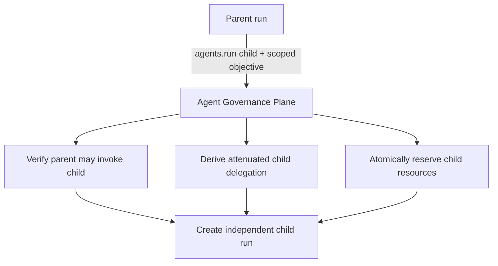

The child gets its own:

- run ID;
- agent identity;
- workload identity;
- evidence stream;
- attenuated resource and capability bounds;
- tenant context inherited from trusted control-plane state unless explicit cross-tenant policy exists.

RFC 8693 allows nested `act` claims to describe a delegation chain, but the RFC does not define a cryptographically append-only multi-hop delegation proof. Each hop in this platform should therefore be authorized and re-issued by the trusted delegation service rather than allowing agents to edit their own actor chains.[4]

A useful capability invariant is:

\[
A_{child} \subseteq A_{parent}
\]

plus the child's own registered capability ceiling.

Resource allocation has a parallel invariant:

\[
B_{child,reserved} \le B_{parent,available}
\]

and delegation depth satisfies:

\[
D_{child}=D_{parent}+1 \le D_{max}
\]

When the child terminates, the authoritative Resource Allocation Service settles trusted usage and immediately credits unused reserved consumable capacity back to the parent's authoritative available pool. Propagation of the updated balance to execution-plane caches may be asynchronous, but no later sibling reservation should be forced to wait for a periodic cleanup job once terminal settlement has committed.

The A2A model in this document is intra-enterprise. Cross-organization agent-to-agent trust is a federation problem and is not implied by the nested actor representation.

---

## 16. Failure semantics and availability decisions

A production design needs explicit behavior when enforcement dependencies fail.

### Identity or policy service unavailable

For write operations, the default should usually be fail closed.

Read-only operations may use a short-lived cached authorization decision where the data classification and business requirements permit it and the cache remains inside the policy-defined freshness bound.

### Governance-plane integrity or signing-key compromise suspected

A suspected compromise of the STS, revocation authority, policy-management path, Resource Allocation Service, approval/declassification authority, or governance signing keys is a security incident rather than an ordinary availability failure. New privileged grants, trust-lowering decisions, resource expansions, and high-risk writes should fail closed while the affected trust root is isolated or rotated.

Gateways should support emergency trust-root/key-epoch revocation so that assertions signed by a compromised key can be rejected even if their nominal token lifetime has not expired. Recovery should require controlled key rotation or policy restoration, reconciliation of gateway trust state, and independently evidenced administrative actions.

### Revocation distribution unavailable

Gateways may continue only while their locally reconciled security state remains within the operation's maximum allowed staleness.

Once that bound expires, a gateway cannot issue a new `ALLOW` that depends on stale revocation state. High-risk writes require live authoritative state.

A recovered gateway reconciles its local epoch state before resuming affected operations.

### Resource Allocation Service unavailable

A Run Governor may continue consuming resources that were already durably allocated to its run if local metering is trustworthy and policy permits disconnected enforcement.

It must not allocate new child budget, extend deadlines, increase quotas, or assume reclaimed capacity until the authoritative allocation service is available.

### MCP gateway unavailable

The run can remain durable in Temporal and retry later. The harness should not bypass the gateway by falling back to direct credentials.

### Side-Effect Ledger unavailable

New mutating operations that require a durable intent record are not dispatched. Read-only operations can follow separate policy.

If ledger state is `UNKNOWN`, the connector follows its tool-specific reconciliation policy rather than blindly retrying.

### LLM provider unavailable

The LLM gateway may route to an approved fallback model if the agent's model policy permits it. Otherwise the workflow remains suspended or retries.

### Memory or content-lineage service unavailable

A workflow that requires governed retrieval should not bypass the Memory Gateway. Policy may permit operation without optional memory, but it should not silently fall back to an ungoverned vector store.

### Approval or declassification channel unavailable

Temporal holds the pending action until an approval or review arrives or the policy-defined deadline expires. Required approval or judgment-based declassification fails closed on timeout.

### Independent evidence plane unavailable

Operational telemetry can degrade independently. An action configured as `PRECOMMIT_REQUIRED` is not dispatched without the required evidence acknowledgement. Lower-risk `ASYNC` evidence may be buffered according to policy.

### Policy changes during a suspended run

The action is re-evaluated on resume. An approval issued under an earlier policy does not automatically override current policy or revocation state.

These decisions are part of the platform contract and should be tested explicitly.

---

## 17. Architectural trade-offs

### The governance plane is a concentrated trust root

Moving authority, revocation, resource allocation, approvals, and declassification into trusted services improves consistency but concentrates security impact. Governance-plane hardening, administrative separation of duties, protected key custody, secure software supply chain, and independent evidence are therefore part of the architecture rather than optional operations hygiene.

The goal is not to pretend that a compromised trust root can be made harmless. It is to minimize standing privilege, reduce single-person and single-key failure modes, make dangerous changes harder to perform silently, and provide controlled revocation and recovery paths when compromise is suspected.

### Central gateways are high-value infrastructure

Concentrating tool, model, and governed-memory traffic simplifies policy and observability but makes the gateways latency-sensitive and highly available security services.

They require regional redundancy, capacity planning, load shedding, and carefully controlled bypass paths. Active-active regional deployments should preserve the same trusted tenant context, revocation semantics, and policy versions rather than becoming independent authorization islands.

### Multi-tenancy increases the value and cost of the control plane

If multiple business units or external tenants share infrastructure, `tenant_id` must come from trusted identity or routing context rather than a harness-supplied tool argument.

Tenant-aware isolation should cover at least:

- agent and skill registries;
- delegation and revocation;
- credential brokerage;
- resource allocation and quotas;
- memory and artifact metadata;
- approvals and declassification;
- Side-Effect Ledger records;
- evidence stores and encryption-key domains.

A useful default invariant is that authority from one tenant cannot name or operate on another tenant's resources unless an explicit cross-tenant sharing policy exists.

### Fine-grained authorization depends on good resource metadata

"May use GitHub" is easy to express and provides weak isolation.

Policies such as:

```text
may comment on pull requests
for repositories owned by this business unit
when the run was delegated for code review
but may not merge protected branches
```

require canonical resource identifiers, ownership data, classifications, and policy-maintained relationships.

The difficult part is frequently the enterprise resource model rather than the policy language.

### Authorization freshness competes with availability

Evaluating current directory, resource, and revocation state on every action maximizes responsiveness but creates dependencies on policy and identity systems.

Short-lived signed assertions, streaming invalidation, periodic reconciliation, and bounded caches can reduce latency while placing an explicit upper bound on staleness.

The bound should be stated as an SLO by risk class and tested under regional partitions and event-stream loss. A stale cache is never an unlimited license to preserve a previous `ALLOW`.

### Policy changes need simulation and controlled rollout

The durable run and evidence model make it possible to test policy changes before enforcement. Three modes should remain distinct:

```text
policy replay
  evaluate recorded historical authorization requests against a proposed policy

simulation
  execute a harness against mock or non-mutating connectors

shadow execution
  run an alternative harness, model, or policy path while suppressing external side effects
```

Policy replay can answer questions such as whether a proposed rule would have blocked or newly allowed historical actions. It should operate on recorded request context and policy inputs rather than treating a new LLM invocation as a deterministic reconstruction of the original reasoning.

New high-impact policy versions should support dry-run or shadow evaluation before becoming authoritative where business risk permits it.

### Durable execution creates versioning obligations

Runs may outlive deployments.

The platform needs a policy for existing runs:

```text
pin run to approved implementation digest
or
migrate durable state through an explicit migration
```

Implicitly moving an in-flight run to a materially different harness makes forensic reconstruction difficult.

### Stronger sandbox isolation costs more

MicroVM-backed environments improve tenant isolation but increase startup time and operational complexity. The platform should reserve stronger isolation for workloads that actually execute untrusted code rather than impose it on every typed-tool agent.

### Strong lineage creates declassification pressure

Conservative taint propagation is safer but can over-constrain low-risk workflows if all derived content remains permanently high-taint. That pressure should be relieved through narrowly governed deterministic extraction or explicitly authorized review, not by allowing the harness to lower trust labels itself.

---

## 18. What should be standardized internally

The enterprise does not need to standardize how agents reason.

It benefits from standardizing the interfaces around them.

A minimal internal agent-runtime contract might cover:

```text
AgentDefinition
RunIdentity
TenantContext
DelegationContext
RevocationContext
ResourceEnvelope
ResourceReservation
RunLifecycle
ToolRequest
ToolResult
SideEffectIntent
ApprovalRequest
DeclassificationRequest
ArtifactReference
ContentTrustMetadata
SandboxInterface
EvidenceEvent
GovernanceChangeEvent
KeyEpoch
```

For example:

```typescript
interface AgentRuntime {
  createRun(agent: AgentRef, objective: unknown): Promise<RunRef>;
  getRun(run: RunRef): Promise<RunState>;
  signalRun(run: RunRef, signal: RunSignal): Promise<void>;
  cancelRun(run: RunRef, reason: string): Promise<void>;
}

interface ResourceAllocator {
  reserveChild(parent: RunRef, child: RunRef, request: ResourceRequest): Promise<ResourceEnvelope>;
  // Terminal settlement atomically records trusted consumption and credits unused
  // reservation back to the parent's authoritative available pool.
  settleUsage(run: RunRef, usage: UsageRecord, terminal?: boolean): Promise<SettlementResult>;
  // Idempotent recovery/fallback for reservations that require explicit reconciliation.
  reclaim(run: RunRef): Promise<ReclaimResult>;
}

interface SandboxService {
  provision(profile: SandboxProfile): Promise<SandboxRef>;
  execute(sandbox: SandboxRef, request: ExecuteRequest): Promise<ExecuteResult>;
  destroy(sandbox: SandboxRef): Promise<void>;
}
```

The stable contract is concerned with identity, authority, revocation, lifecycle, resources, content trust, side effects, and evidence.

The harness remains replaceable.

This direction is visible in current vendor systems. Anthropic describes stable session/harness/sandbox interfaces intended to survive changes in harness implementation.[1] Microsoft is making agent identity a separate governable enterprise object.[2] MCP is adding enterprise-managed authorization for centrally governed tool connectivity.[6] NIST is explicitly studying how existing identity and authorization standards apply to software and AI agents.[15]

---

## 19. A practical implementation path

The complete architecture is large. Adoption can be staged while preserving the hard-to-retrofit security boundaries.

### Stage 0: prove the non-bypassable boundary

```text
Identity:
  existing enterprise IdP
  normal OAuth access tokens
  existing workload identity

One agent / one tool domain:
  stable run identity
  centralized tool PEP
  credential brokerage
  stable tool_call_id
  durable mutation intent
  structured security evidence
```

The purpose of Stage 0 is to prove that reusable enterprise credentials stay outside the harness and that consequential actions cross a non-bypassable enforcement point. Durable multi-day orchestration is not required to prove that boundary.

### Stage 1: durable governed agents

```text
Control plane:
  registered agents and approved digests
  REST run API
  Resource Allocation Service
  Revocation Controller
  action-bound approvals
  protected governance administration / key custody
  independent evidence for privileged governance changes

Execution:
  Kubernetes
  Temporal or equivalent
  Run Governor

Tools and models:
  central MCP gateway
  Side-Effect Ledger
  OAuth credential broker
  existing LLM gateway

Supply chain:
  OCI registry
  Cosign signatures and admission verification

Evidence:
  OpenTelemetry for operations
  independent structured security events
  immutable or WORM storage for selected evidence
```

### Stage 2: platform ecosystem

```text
subagent delegation with atomic resource reservation
content lineage and taint
explicit declassification workflows
governed cross-run memory
multi-tenant partitioning
policy replay / simulation / shadow execution
multi-region gateway redundancy
```

### Initial delegation and resource rules

The initial authorization rule can remain:

```text
allowed action =
    current user entitlement
  ∩ registered agent capability
  ∩ run resource constraints
  ∩ current gateway policy
```

Resource accounting adds the parallel rule that descendants cannot reserve or consume more than the parent subtree allocation.

More sophisticated multi-hop delegation or capability tokens can be added later without changing the trust boundary.

The early decisions that are difficult to retrofit are:

1. reusable enterprise credentials never enter prompts or arbitrary code environments;
2. consequential tool calls cross a non-bypassable enforcement point;
3. human, agent, workload, and tenant identities remain distinguishable;
4. run lifetime is independent of worker lifetime;
5. revocation is enforced at trusted gateways rather than by worker cancellation;
6. resource reservations are authoritative, atomic, and non-expanding across child runs;
7. side-effect semantics are explicit and tool-specific, including ambiguous `UNKNOWN` outcomes;
8. agent and skill implementations are immutable and attributable;
9. approvals and declassifications are bound to specific actions or transformations rather than broad sessions;
10. content provenance and taint survive summarization and memory promotion;
11. evidence records preserve enough information to reconstruct consequential actions;
12. selected high-risk writes can require independent evidence acknowledgement before dispatch;
13. governance-plane administrative authority, signing keys, policy publication, and trust-lowering operations are themselves strongly controlled and independently evidenced.

---

## Conclusion

The main components of an enterprise agent execution platform already have mature predecessors:

- OpenID Connect and OAuth for human authentication and API authorization;
- RFC 8693 for token exchange and actor/subject delegation semantics;
- OAuth Security BCP, mTLS, and DPoP for audience and sender constraints;
- SPIFFE/SPIRE or cloud workload identity for runtime processes;
- existing policy engines for authorization decisions;
- MCP for tool interfaces and enterprise-managed server authorization;
- Kubernetes for compute scheduling and isolation;
- Temporal or equivalent systems for durable workflow execution;
- OCI and Sigstore for artifact distribution and provenance;
- CloudEvents and immutable storage as components of an evidence pipeline.

What remains less standardized is the contract connecting those components into a vendor-neutral agent runtime.

A useful enterprise boundary is:

```text
Identity establishes who is involved.

Delegation establishes the maximum authority available.

Revocation determines whether that authority remains usable now.

The Resource Allocation Service establishes how much consumable capacity
may be reserved by a run and its descendants.

The Run Governor enforces the issued resource envelope.

The runtime keeps the run durable.

The harness proposes what happens next.

Content lineage describes what influenced that proposal and how trusted it is.

Gateways decide what may actually happen now.

The Side-Effect Ledger makes retries and ambiguous external outcomes explicit.

Sandboxes contain untrusted computation.

Signed artifacts establish which implementation, skills, and policy were loaded.

Protected governance administration and key custody constrain who can change
the trust root that issues authority, revocation, budgets, and declassifications.

The independent evidence plane records enough information to reconstruct
consequential side effects and governance decisions.
```

This arrangement permits models and harnesses to evolve independently of the organization's main security boundary.

The design can be summarized as five closed control loops, all resting on a cross-cutting governance-root protection layer:

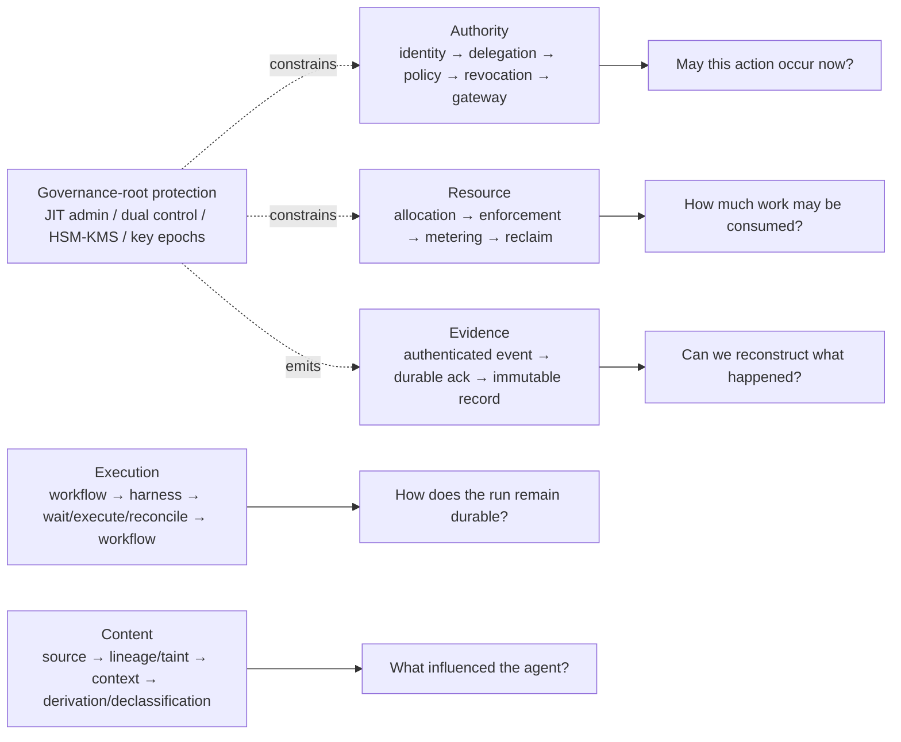

That is the property an enterprise execution platform should preserve: **the harness remains replaceable, while authority, bounded execution, governed content, side effects, and evidence remain enforceable outside it.**

---

## References

1. Anthropic Engineering, **Scaling Managed Agents: Decoupling the brain from the hands**, Apr. 8, 2026. https://www.anthropic.com/engineering/managed-agents
2. Microsoft Learn, **Agent identities in Microsoft Entra Agent ID**. https://learn.microsoft.com/en-us/entra/agent-id/agent-identities
3. SPIFFE/SPIRE documentation: **SPIFFE Workload API**, **SPIRE Concepts**, and **SPIFFE Overview**. https://spiffe.io/docs/latest/
4. IETF, **RFC 8693: OAuth 2.0 Token Exchange**. https://www.rfc-editor.org/rfc/rfc8693.html
5. IETF, **RFC 9700: Best Current Practice for OAuth 2.0 Security**; **RFC 9449: OAuth 2.0 Demonstrating Proof of Possession**. https://www.rfc-editor.org/rfc/rfc9700 ; https://www.rfc-editor.org/rfc/rfc9449
6. Model Context Protocol, **Enterprise-Managed Authorization**, stable announcement Jun. 18, 2026. https://modelcontextprotocol.io/extensions/auth/enterprise-managed-authorization
7. Model Context Protocol, **Extension Support Matrix**. https://modelcontextprotocol.io/extensions/client-matrix
8. Temporal documentation, **Activity Definition**. https://docs.temporal.io/activity-definition
9. Temporal documentation, **Continue-As-New**. https://docs.temporal.io/workflow-execution/continue-as-new
10. Kata Containers, project overview and architecture. https://katacontainers.io/
11. Open Container Initiative, **OCI Image Manifest Specification — Guidelines for Artifact Usage**. https://specs.opencontainers.org/image-spec/manifest/
12. Sigstore, **Cosign Quickstart / Signing and Verifying**. https://docs.sigstore.dev/quickstart/quickstart-cosign/
13. CNCF CloudEvents, **CloudEvents Specification and Primer**. https://github.com/cloudevents/spec
14. AWS, **S3 Object Lock — Compliance Mode**. https://docs.aws.amazon.com/AmazonS3/latest/userguide/object-lock.html
15. NIST NCCoE, **Accelerating the Adoption of Software and Artificial Intelligence Agent Identity and Authorization**, Feb. 5, 2026. https://csrc.nist.gov/pubs/other/2026/02/05/accelerating-the-adoption-of-software-and-ai-agent/ipd
