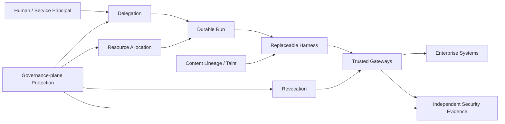

# Designing an Enterprise Execution Platform for AI Agents

**Revision: 0.5.0**

AI agents are moving from conversational assistants toward software actors that perform work on behalf of employees: querying internal systems, modifying tickets, reviewing code, executing scripts, operating cloud infrastructure, and coordinating workflows that may span hours or days.

Selecting an agent framework—LangGraph, Claude Agent SDK, OpenAI Agents SDK, Google ADK, Microsoft Agent Framework, or a custom loop—is an application-level choice. The platform problem is broader: **how does an enterprise support a heterogeneous ecosystem of agent clients and harnesses without making every harness part of the Trusted Computing Base (TCB)?**

An organization should assume that agents will be invoked through multiple entry points: ChatGPT Enterprise, Claude, IDE extensions, internal applications, CI/CD pipelines, and other agents. Those agents need access to systems such as GitHub, Slack, Jira, databases, cloud APIs, internal services, and specialized subagents.

The design objective is **enterprise agent governance**:

> For every consequential action, the organization should be able to establish which human or service initiated the work, which agent acted, which run the action belonged to, what authority was available to that run, which implementation and policy versions were in force, and what external side effect occurred.

The architecture in this article treats model reasoning and harness logic as replaceable application code. Identity, delegation, execution durability, tool authorization, credential custody, isolation, and evidence collection are platform responsibilities.

The proposal uses established security and distributed-systems primitives where possible. It does not assume that a single standard currently defines an enterprise agent runtime.

---

## Executive summary: invariants cheat sheet

The full document is a reference specification. Teams implementing the first production stage should be able to keep the following shorter view open while building. The central architectural choice is that **the harness proposes; trusted platform components authorize, allocate, constrain, and record**.

| Invariant | Authoritative owner | Required property |
| --- | --- | --- |
| Harness non-expansion | Governance policy + gateways | Prompts, skills, models, memory, and subagents cannot enlarge run authority. |
| Credential isolation | STS / credential broker | Reusable enterprise credentials never enter model context or arbitrary harness/sandbox code. |
| Side-effect authorization | MCP Gateway / trusted PEP | Consequential actions are authorized at the non-bypassable gateway at execution time. |
| Revocation | Revocation Controller + gateways | Once revocation is effective at the enforcement plane, new governed side effects for that scope are denied. |
| Resource containment | Resource Allocation Service + Run Governor | Descendants cannot double-spend, mint, or exceed the resource envelope delegated by ancestors. |
| Durable execution | Workflow engine | Run lifetime is independent of worker lifetime; durability does not grant authority. |
| Content trust | Content-lineage / declassification services | Untrusted content does not become trusted merely through summarization or model transformation. |
| Side-effect ambiguity | Side-Effect Ledger | Ambiguous external outcomes remain explicit as `UNKNOWN` until reconciled, compensated, or reviewed. |
| Governance-root protection | Privileged administration + HSM/KMS + independent evidence | Governance services and signing authority are themselves access-controlled, dual-controlled where required, key-protected, and independently evidenced. |
| Evidence independence | Security evidence plane | Selected high-risk operations can depend on evidence acknowledgement from a security domain independent of the harness and runtime. |

A useful implementation rule is: **for every invariant, name the authoritative state owner, the enforcement point, the maximum permitted staleness, and the fail-safe behavior when dependencies are unavailable.**

---

