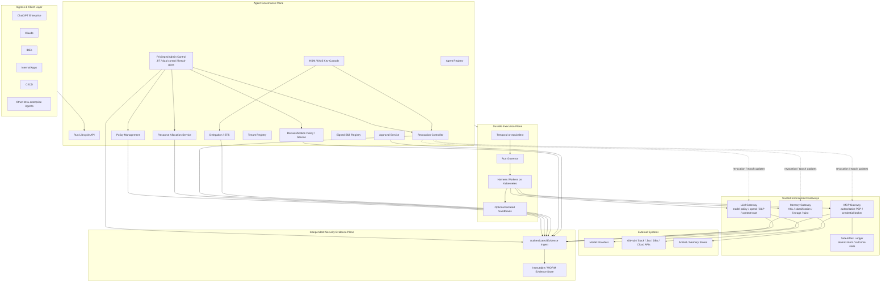

## 2. Reference architecture and separation of concerns

A useful starting point is to separate the agent's reasoning loop from the infrastructure that gives an execution identity, authority, durability, resource bounds, governed access to external systems, content trust context, and reconstructable evidence.

The detailed diagram intentionally distinguishes several kinds of control. The executive-summary diagram above is the conceptual view; this diagram shows the concrete trusted services and data paths.

- the **Agent Governance Plane** owns durable governance state such as registered identities, delegation, revocation state, policy, tenant context, approvals, authoritative resource allocation, and protected administrative/key-management functions;
- the **Durable Execution Plane** owns run lifecycle and local enforcement of a resource envelope, but it does not grant authority to itself;
- the **trusted gateways** are the reference monitors for consequential model, tool, and memory operations;
- the **Side-Effect Ledger** records mutation intent and ambiguous outcomes at the trusted tool boundary;
- the **Independent Security Evidence Plane** has failure semantics that can differ from ordinary operational telemetry.

Anthropic has publicly described a related decomposition for long-running hosted agents: a durable **session**, a replaceable **harness**, and a separately provisioned **sandbox**. The important idea is the interface boundary, not the vendor-specific implementation.[1]

### Domain definitions

**Agent definition**  
A registered enterprise asset describing an agent's owner, approved implementation, risk classification, allowed models, capability ceiling, skills, subagents, and operational limits.

**Harness**  
Application code implementing model interaction and reasoning: context construction, model calls, tool selection, compaction, planning, subagent orchestration, and termination logic. The harness is replaceable application code rather than a trusted authorization component.

**Run**  
One globally unique execution of an agent against a particular objective. A run carries an initiating principal, agent identity, tenant context, policy context, delegation ceiling, resource envelope, lineage context, and lifecycle state.

**Runtime**  
Infrastructure that provides durable orchestration, workload identity, isolation, scheduling, quotas, local resource enforcement, and interaction with trusted enforcement services.

**Run Governor**  
An execution-plane enforcement component that consumes a resource envelope issued by the governance plane and enforces rate, concurrency, depth, runtime, and other local ceilings. It may decrease available resources through consumption but cannot enlarge the envelope.

**Resource Allocation Service**  
The authoritative governance-plane owner for consumable resource accounting. It performs atomic reservations, parent/child allocation, usage settlement, and reclaim. It is the source of truth when several child runs allocate resources concurrently.

**Revocation Controller**  
The authoritative owner of revocation state and revocation epochs. It distributes changes to trusted enforcement points and supports reconciliation after missed events or partitions.

**Artifact**  
A unit of content that can influence execution, including a document, tool result, retrieved memory object, model-generated summary, uploaded file, or extracted structured value. Governed artifacts carry provenance, classification, integrity, and content-trust metadata.

**Side-Effect Ledger**  
An ACID-backed record at the trusted tool boundary that persists mutation intent before dispatch and records known, failed, or ambiguous external outcomes.

**Sandbox**  
An optional disposable execution environment for untrusted or model-generated code. A sandbox is not required for agents that operate exclusively through typed tools.

---

