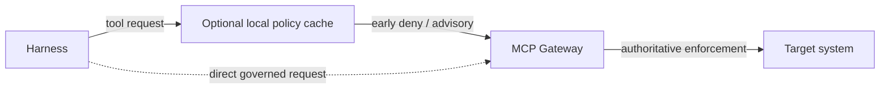

## 3. Threat model and security invariants

The design assumes that a harness may make incorrect or adversarial decisions.

Possible causes include:

- direct prompt injection;
- indirect prompt injection through documents, tickets, web pages, tool output, or memory;
- malicious or compromised skills;
- model errors;
- vulnerable harness dependencies;
- arbitrary code generated by the model;
- compromised external content stored in long-term memory;
- runaway loops, recursive subagent spawning, or denial-of-wallet behavior;
- stale authorization state during long-running execution;
- compromise or misuse of a trusted governance-plane service, privileged administrator, signing key, or policy-management path;
- supply-chain compromise of governance-plane components that issue tokens, revocations, resource allocations, approvals, or declassification decisions.

The platform therefore uses a reference-monitor pattern.

> **The harness may request an action. A trusted enforcement point determines whether the action is allowed.**



The local evaluator is an optimization. The gateway is the boundary.

The system is designed around the following invariants.

### Invariant 1: a harness cannot grant itself authority

Loading a new prompt, skill, model, memory object, tool result, or subagent must never expand the authorization ceiling of the current run.

### Invariant 2: enterprise credentials remain outside the reasoning environment

Long-lived OAuth refresh tokens, API keys, cloud credentials, browser session cookies, and similar credentials should not be exposed to the model context, sandbox, or arbitrary harness code.

### Invariant 3: security-critical authorization is enforced at the gateway

A local policy sidecar may reject requests early or cache policy data for latency reasons. It is not sufficient as the only enforcement point if the harness can communicate directly with the gateway.

The MCP gateway must either evaluate the relevant authorization decision itself or verify a short-lived, cryptographically protected authorization decision produced by a trusted policy service.

### Invariant 4: authorization is checked at side-effect time

A run may last for hours or days. During that time a user may leave a group, an agent may be disabled, a repository may become protected, or policy may change.

The run's delegation establishes an upper bound, but security-sensitive tool calls should be re-evaluated against current policy when they execute.

```text
run delegation      = maximum authority granted when the run was created
live authorization  = current permission to execute this specific action
```

A run can therefore lose authority while it is still active.

### Invariant 5: revocation is enforced at the trusted enforcement plane

Workflow or activity cancellation is not the security boundary.

```text
workflow cancellation = stop logical execution
activity cancellation = best-effort stop of in-flight computation
gateway revocation     = prevent new governed side effects
```

The security guarantee is:

> **After revocation becomes effective at the enforcement plane, no new governed side effect may be authorized for the revoked scope.**

Revocation may target a run, agent, agent version, skill digest, principal, tenant, tool, policy version, or the entire platform.

### Invariant 6: resource authority cannot be double-spent or expanded by descendants

Capabilities are not the only attenuating quantity. A run also receives a bounded resource envelope.

For a consumable budget \(B_r\):

\[
\operatorname{Spend}(\operatorname{subtree}(r)) \le B_r
\]

and child reservation must satisfy:

\[
B_{child,reserved} \le B_{parent,available}
\]

Reservations that modify shared parent capacity must be atomic at the authoritative Resource Allocation Service. A Run Governor may enforce an issued envelope but cannot mint additional budget.

### Invariant 7: untrusted content cannot become trusted merely by passing through an LLM

Every governed content artifact carries source and trust metadata. Derived content conservatively inherits the highest applicable taint of its inputs unless a trusted declassification operation explicitly lowers it.

A summary of an untrusted document is therefore not automatically trusted.

### Invariant 8: selected high-risk side effects depend on independent security evidence

Operational telemetry and security evidence are distinct paths. Policy may require durable acknowledgement of authorization and mutation intent by the independent evidence plane before a selected high-risk side effect is dispatched.

### Invariant 9: governance authority is itself governed

The Agent Governance Plane is part of the TCB and is therefore a high-value compromise target. Administrative access to the STS, Revocation Controller, Resource Allocation Service, policy system, Approval Service, or Declassification Service must not be treated as ordinary application administration.

High-impact governance changes should use strong workload/admin identity, least privilege, separation of duties or dual control where appropriate, protected signing-key custody, and independently emitted security evidence. A single compromised harness must not be able to become a governance administrator, and a single ordinary platform administrator should not silently be able to mint arbitrary enterprise authority without leaving independently governed evidence.

---

