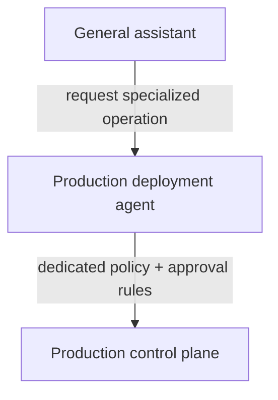

## 4. Identity and delegation

The platform needs to distinguish at least three identities:

```text
human or calling service
agent
runtime workload
```

They answer different questions.

A multi-tenant deployment also carries a trusted **tenant context**. Tenant is not a fourth actor identity; it is a security partition derived from authenticated identity or trusted routing state and used to namespace policy, credentials, resource accounting, memory, and evidence. It must not be accepted as an arbitrary harness-supplied field.

The human identity answers **who initiated or approved the work?**

The agent identity answers **which governed software actor is operating?**

The workload identity answers **which running process is presenting this request?**

Microsoft's Entra Agent ID is evidence that this distinction is becoming a first-class enterprise identity problem. Microsoft now represents agent identities separately and supports delegated scenarios in which the access token subject is the user while the actor identifies the agent.[2]

### 4.1 Human authentication: OIDC; API authorization: OAuth

OpenID Connect is appropriate for authenticating interactive users to clients and control-plane applications.

OAuth access tokens protect APIs.

It is useful to keep those roles explicit rather than referring to an "OIDC-protected REST API." The REST API normally accepts OAuth access tokens whose human authentication may have originated from an OIDC sign-in flow.

### 4.2 Workload identity with SPIFFE/SPIRE

A Kubernetes service account or cloud-native workload identity may be sufficient in a single-cloud deployment. SPIFFE provides a vendor-neutral model when workloads span clusters or environments.

SPIFFE SVIDs provide short-lived cryptographic workload identity. SPIRE can determine which identity to issue using workload and node attestation selectors.[3]

An SVID establishes the identity of a workload according to the configured trust and attestation rules. It does **not** by itself prove that the workload binary is untampered or that the process is executing on confidential hardware. Binary provenance and hardware attestation require separate controls.

A harness worker may therefore present:

```text
workload identity:
  spiffe://corp.example/agents/github-pr-reviewer

run context:
  user  = alice
  agent = github-pr-reviewer
  run   = run-991823ab
```

### 4.3 Delegated authority with OAuth 2.0 Token Exchange

RFC 8693 defines OAuth 2.0 Token Exchange. It supports a `subject_token`, an optional `actor_token`, requested scopes and target resources, and defines the JWT `act` claim for expressing an acting party.[4]

This makes it a useful building block for user-plus-agent delegation.

A conceptual request could be:

```http
POST /oauth/token
Content-Type: application/x-www-form-urlencoded

grant_type=urn:ietf:params:oauth:grant-type:token-exchange
&subject_token=<alice-access-token>
&subject_token_type=urn:ietf:params:oauth:token-type:access_token
&actor_token=<agent-workload-assertion>
&actor_token_type=urn:ietf:params:oauth:token-type:jwt
&resource=https://mcp.corp.example/github
&scope=github.pull.read github.pull.comment
```

The authorization server can issue an audience-restricted, short-lived token representing Alice as the subject and the PR-review agent as the actor.

```json
{
  "iss": "https://identity.corp.example",
  "sub": "alice@corp.example",
  "act": {
    "sub": "spiffe://corp.example/agents/github-pr-reviewer"
  },
  "aud": "https://mcp.corp.example/github",
  "exp": 1786125600,
  "scope": "github.pull.read github.pull.comment",
  "run_id": "run-991823ab",
  "tenant_id": "engineering",
  "security_epoch": 193,
  "resource_constraints": {
    "github.repository": "engineering/payments",
    "github.pull_request": 842
  }
}
```

Two qualifications matter.

First, RFC 8693 supplies the exchange mechanism; it does not automatically implement least-privilege attenuation. The authorization server and resource server must define and enforce how requested scope, user entitlement, agent policy, resource constraints, and current policy interact.

Second, fields such as `run_id`, `tenant_id`, `security_epoch`, and `resource_constraints` are deployment-specific claims. They are useful if every receiving enforcement point has defined semantics for them; they are not standardized by RFC 8693.

### 4.4 Capability attenuation

A useful authorization invariant is:

\[
A_{effective} \subseteq A_{human} \cap A_{agent} \cap A_{run}
\]

The notation is intentionally a subset relation rather than an equality. A resource server may apply additional restrictions based on current resource state, environmental policy, approval requirements, risk, or downstream platform rules.

For example:

```text
Alice:
  read repo A
  merge repo A
  administer repo A

PRReviewAgent:
  read repository
  comment on pull request

Run 991823ab:
  repository = A
  pull request = 842

Effective request ceiling:
  read PR 842
  comment on PR 842
```

### 4.5 Specialized agents for sensitive roles

Some authority should not be delegated to a general-purpose assistant even if the user possesses it.

Production deployment is an example.



The specialized agent has its own identity, owner, implementation, allowed tools, and risk controls.

This creates a separation-of-duties boundary and limits the effect of a compromised general assistant.

### 4.6 Sender-constrained tokens

Short lifetimes reduce token exposure but do not prevent replay during the token's validity period.

OAuth Security Best Current Practice recommends sender-constrained and audience-restricted access tokens where practical. Standard mechanisms include mutual-TLS certificate-bound tokens and DPoP.[5]

For a server-side runtime, mTLS binding to workload-held key material is a natural option. DPoP is another option when application-layer proof-of-possession is operationally easier.

The relevant property is:

```text
stolen access token alone != usable credential
```

---

