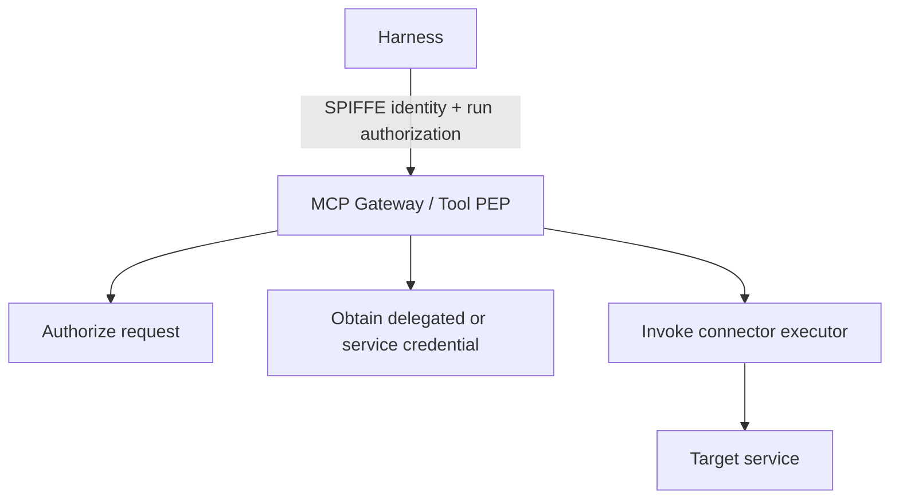

## 5. MCP gateway and enterprise tool plane

The MCP gateway is the primary enforcement point for tool use.

Its responsibilities include:

- tool and server discovery;
- client authentication;
- authorization;
- resource and argument constraints;
- credential brokerage;
- revocation and authorization-freshness enforcement;
- rate limits and quotas;
- approval obligations;
- request and response policy;
- durable side-effect intent for mutating operations;
- audit evidence;
- routing to connector executors or MCP servers.

### 5.1 Enterprise-managed MCP authorization

The MCP Enterprise-Managed Authorization extension became stable in June 2026. It allows an enterprise identity provider to become the centralized authority for MCP-server access instead of requiring a separate user authorization flow for each server.[6]

That is useful for server-level discovery and access.

It is not, by itself, a complete policy model for individual agent actions. The enterprise platform still needs to evaluate questions such as:

```text
Can this agent, in this run, acting for this principal,
invoke this tool against this resource with these arguments now?
```

The MCP project also notes that extension support is client-dependent, so the platform should not require every client to implement the extension before it can participate.[7]

A managed client may use the extension directly. Other clients can enter through the enterprise agent API and let the platform handle tool authorization internally.

### 5.2 Gateway registry metadata

The tool registry should include governance metadata rather than only schemas and URLs.

```yaml
tool: github.pull.merge
classification: write
risk: high

allowed_agent_classes:
  - repository-maintainer
  - release-manager

constraints:
  protected_branch:
    approval_required: true

authorization:
  freshness_class: high-risk-write

idempotency:
  ledger_required: true
  downstream_mode: downstream-key

evidence:
  mode: PRECOMMIT_REQUIRED
  payload_policy: hash-and-short-retention
```

This lets discovery and enforcement use the same catalog.

### 5.3 Credential brokerage

The harness should invoke logical tools, not obtain the corresponding downstream credential.



A generic secrets manager may store certain credentials, but OAuth refresh-token custody and token minting are better treated as a credential-broker or security-token-service responsibility.

The ephemeral downstream access token should normally be visible only to the connector executor that needs it.

---

