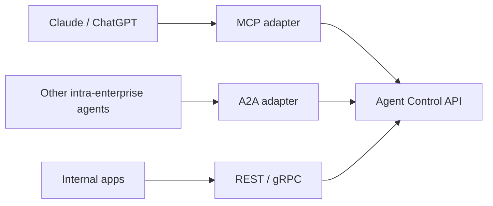
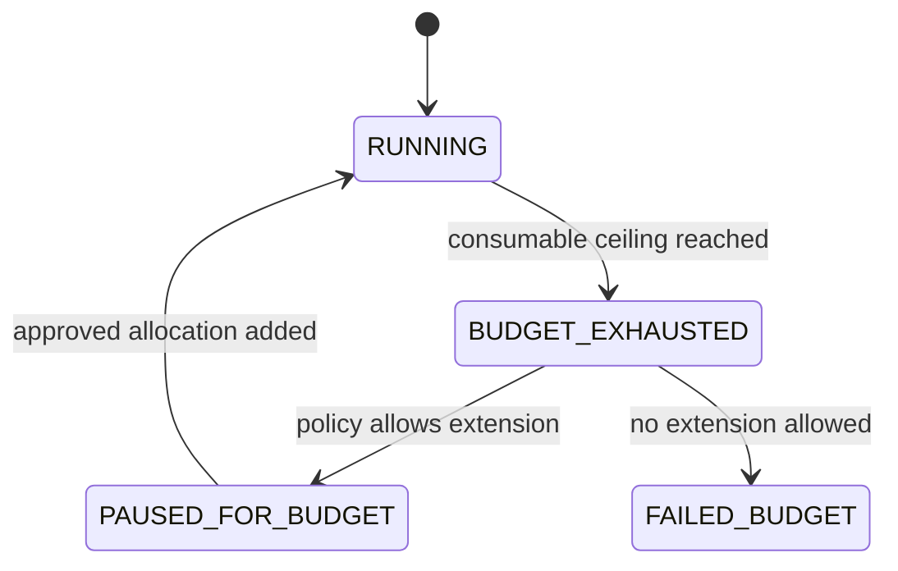
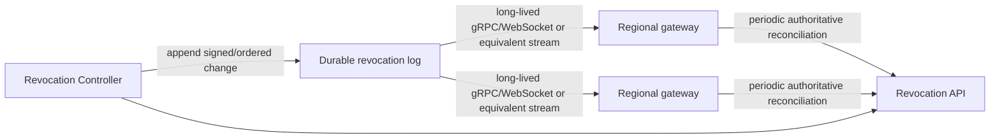
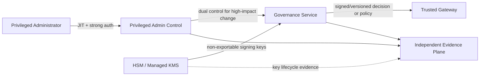

## 6. The agent governance plane

Agents should be registered services rather than anonymous processes. The governance plane owns durable control state that must not depend on a harness worker remaining alive.

It should answer:

```text
Which agents exist?
Who owns and sponsors each one?
Which implementation versions are approved?
Who may invoke an agent?
Which tools and skills can it use?
Which models may it call?
What risk class does it belong to?
What execution and spending limits apply?
Which tenant owns this run?
Which runs are currently active?
Which runs, agents, skills, or principals are revoked?
```

A registry entry might look like:

```yaml
id: production-incident-investigator
owner: sre-platform
risk_class: medium

implementation:
  image: registry.corp/agents/incident-investigator@sha256:...

allowed_models:
  - confidential-general

skills:
  - corp://skills/kubernetes-diagnostics@sha256:...
  - corp://skills/incident-process@sha256:...

tools:
  - kubernetes.read
  - datadog.query
  - pagerduty.read

subagents:
  - log-investigator
  - change-correlator

limits:
  max_runtime: 4h
  max_llm_budget_usd: 25
  max_tool_calls_per_minute: 10
  max_active_children: 3
  max_delegation_depth: 3
```

### 6.1 Stable run API

The runtime should expose a harness-independent API.

```http
POST /v1/agents/{agent_id}/runs
GET  /v1/runs/{run_id}
POST /v1/runs/{run_id}/signals
POST /v1/runs/{run_id}/cancel
GET  /v1/runs/{run_id}/events
```

A create request contains the objective and input context:

```json
{
  "objective": "Review pull request 842",
  "input": {
    "repository": "engineering/payments",
    "pull_request": 842
  },
  "constraints": {
    "max_execution_time_seconds": 7200,
    "max_budget_usd": 5
  }
}
```

The caller authenticates to the API using the normal Authorization header. The control plane obtains the caller identity and trusted tenant context from the verified access token and performs token exchange or delegation internally.

The API should **not** require callers to place raw delegation tokens inside JSON request bodies; those payloads are more likely to be copied into application logs and traces.

The server should resolve the approved agent version by policy. An explicit version can be supported for testing or controlled rollback, but an arbitrary client should not be able to select an unapproved historical version.

### 6.2 Protocol adapters

REST or gRPC can remain the canonical lifecycle API.

Other interfaces can adapt to it:



An MCP adapter might expose:

```text
agents.list
agents.describe
agents.run
agents.status
agents.signal
agents.cancel
```

This keeps MCP useful for ergonomic agent-to-agent discovery without making the internal lifecycle model depend on MCP.

The A2A adapter described here assumes agents within the same enterprise trust and identity domain. Cross-organization agent delegation requires explicit federation, trust translation, capability mapping, and per-hop re-issuance and is outside the initial architecture.

### 6.3 Resource allocation and run governance

The Resource Allocation Service and Run Governor have deliberately different responsibilities.

```text
Resource Allocation Service = authoritative accounting and reservation
Run Governor                = enforcement of an already-issued envelope
```

The governance plane issues a resource vector such as:

```yaml
resources:
  consumable:
    usd_budget: 25
    llm_tokens: 2000000
    tool_calls: 1000
    sandbox_cpu_seconds: 3600
    egress_bytes: 1000000000

  structural:
    max_tool_calls_per_minute: 10
    max_active_children: 3
    max_total_children: 10
    max_delegation_depth: 3

  deadlines:
    run_deadline: 2026-08-08T16:00:00Z
```

These dimensions have different semantics.

**Consumable resources** use reservation, metering, settlement, and reclaim.

**Structural limits** are hard non-expandable ceilings such as delegation depth or maximum concurrency.

**Deadlines** stop or suspend further work when reached, but policy may permit an explicit governance action to extend them. The harness cannot extend its own deadline.

The resource vector is extensible. Deployments may add dimensions such as GPU time, browser minutes, database-query units, or tenant-specific service credits. New dimensions must declare whether they are consumable, structural, or deadline-like and must preserve the same non-expansion, atomic-reservation, trusted-metering, and settlement rules.

#### Atomic child reservations

If several children are created concurrently, parent capacity is shared mutable state. The reservation check must therefore be serialized or atomically conditional at the Resource Allocation Service.

A useful accounting invariant is:

\[
AllocatedChildren(r) + SpendDirect(r) + Available(r) = B_r
\]

A child reservation succeeds only if sufficient parent capacity remains at commit time.

#### Dynamic reclaim

When a child reaches a terminal state such as `COMPLETED`, `FAILED`, `CANCELLED`, or `TIMED_OUT`, terminal usage settlement must release unused reserved capacity back to the parent's available pool:

\[
B_{unused}=B_{reserved}-B_{consumed}
\]

The authoritative settlement transaction should atomically close or settle the child's reservation and durably credit `B_unused` to `B_parent,available`. Notification of the new balance to sibling Run Governors may be asynchronous, but the credit itself must become authoritative immediately after settlement so sibling allocations do not suffer artificial budget starvation.

For example, if a parent reserves `$10` for a child and trusted metering records `$2` consumed at completion, settlement credits the remaining `$8` back to the parent's available allocation pool. Repeated settlement or reclaim requests must be idempotent.

Consumption is based on trusted metering, not on a child harness self-report.

#### Exhaustion states

Budget or quota exhaustion is a lifecycle condition rather than merely a billing alert.



### 6.4 Revocation controller and epochs

The Revocation Controller owns authoritative revocation state. Useful scopes include:

```text
run_id
agent_id
agent_version
skill_digest
principal_id
tenant_id
tool_id
policy_version
global
```

A deployment may maintain monotonic values such as:

```text
security_epoch
tenant_policy_epoch
agent_revocation_epoch
```

Short-lived delegated tokens or authorization assertions can record the epoch under which they were issued. A gateway rejects an assertion when its applicable epoch is older than authoritative revocation state.

A reference distribution design uses both streaming push and authoritative reconciliation:



Gateways should maintain a long-lived streaming subscription to the revocation distribution path. The transport is an implementation choice—gRPC streaming, WebSocket, managed pub/sub, or an equivalent ordered fanout—but the security contract is not: push minimizes latency while reconciliation repairs missed events, gateway restarts, stream gaps, and recovery after partitions.

Each trusted gateway should track at least its last applied epoch, last successful stream receipt, and last successful authoritative reconciliation. If connectivity to authoritative revocation state is lost long enough that the gateway's security state exceeds the operation's maximum staleness SLO, the gateway automatically degrades to a fail-closed posture for new evaluations that require fresher state. A stale local cache cannot be used to manufacture a new `ALLOW` after its bounded validity expires.

Reference defaults might be:

```text
high-risk write:
  cached ALLOW prohibited; live authoritative state required

normal write:
  maximum revocation-state age <= 30 seconds

sensitive read:
  maximum revocation-state age <= 60 seconds

low-risk read:
  deployment-policy-defined bounded cache
```

The numbers are deployment defaults that can be tightened. The high-risk-write rule is an invariant rather than a tuning suggestion.

### 6.5 Governance-plane self-protection

The governance plane is a trust root, not an ordinary collection of internal microservices. Compromise of the STS signing path, Revocation Controller, Resource Allocation Service, policy-management system, Approval Service, or Declassification Service could otherwise create apparently valid tokens, epochs, budgets, approvals, or trust labels that downstream gateways would accept.

A reference protection model should include:

- **strong administrative identity and just-in-time privilege** rather than broad standing administrator roles;
- **separation of duties / four-eyes control** for high-impact changes such as trust-root rotation, global revocation rollback, policy bypass, emergency resource expansion, declassification-policy changes, or creation of privileged agent classes;
- **HSM- or managed-KMS-backed custody** for STS signing keys, epoch-signing keys, and other keys whose compromise would let an attacker forge trusted governance assertions;
- **short-lived service credentials and workload identity** between governance services, with explicit service-to-service authorization rather than implicit network trust;
- **signed and versioned policy/configuration artifacts** with controlled promotion into authoritative environments;
- **independent evidence emission** for privileged governance actions, including token-signing-key rotation, policy publication, revocation changes, resource-limit overrides, approval-policy changes, and declassification-policy changes;
- **break-glass procedures** that are narrow, time-bounded, strongly authenticated, and separately evidenced rather than an undocumented bypass path.

Governance services should not share a single unrestricted administrator credential or common signing key merely for convenience. Where practical, compromise domains should be separated so that control of one service does not automatically imply control of every governance function.



The independent evidence plane should be administered under a security domain that is not reducible to the same application-admin path used to modify the governance service producing the event. This does not make governance compromise impossible, but it raises the number of independently controlled boundaries an attacker must defeat and preserves evidence for investigation.

---

