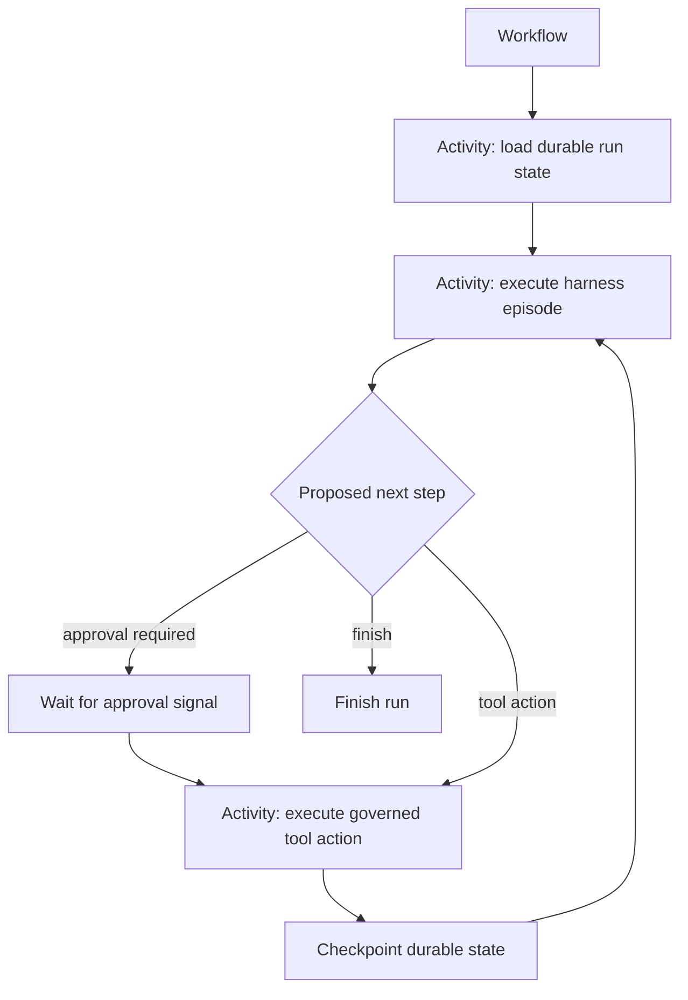

## 7. Durable execution: Kubernetes plus a workflow engine

Kubernetes and Temporal solve different problems.

### Kubernetes provides the compute plane

- worker scheduling;
- autoscaling;
- workload identity integration;
- resource limits;
- network policy;
- runtime classes;
- pod and node isolation.

### Temporal provides the logical execution lifecycle

- durable workflow state;
- activity retries;
- timers;
- external signals;
- long waits;
- cancellation;
- recovery after worker failure.

The core invariant is:

\[
\text{Run lifetime} \ne \text{Worker process lifetime}
\]

Temporal describes Activities as the boundary for unreliable or non-deterministic operations and automatically retries them when configured to do so.[8]

The workflow engine owns durable progression. It does not own the platform's authorization, revocation, credential, or resource-allocation authority.

### 7.1 Do not execute arbitrary harness logic as deterministic workflow code

Temporal workflow code is replayed and must obey deterministic execution rules. LLM calls, external network calls, and arbitrary agent-framework operations are non-deterministic.

A practical design is to keep the Temporal workflow small and use Activities for externally observable work.



The exact granularity is a design trade-off. A framework that already supports resumable checkpoints may run several agent turns inside one Activity. The workflow should still persist enough state to recover without assuming that a particular worker survives.

### 7.2 Run Governor

The Run Governor enforces the resource envelope issued by the governance plane. It is not the authoritative allocator.

Typical responsibilities include:

- rejecting tool or model requests after the run's consumable allocation is exhausted;
- limiting tool-call rate;
- limiting active child runs;
- enforcing delegation depth;
- bounding sandbox concurrency;
- suspending work at policy-defined deadlines;
- reporting trusted usage to the Resource Allocation Service.

The Run Governor must fail closed with respect to enlargement: if it cannot validate its current envelope, it must not assume additional resources are available.

### 7.3 Temporal history is not the model's memory database

Temporal's event history should contain workflow state and references required for durable replay. Large prompts, artifacts, tool outputs, and model transcripts belong in external object or session storage with hashes and durable references recorded in workflow state.

The platform should configure an inline-payload threshold materially below the workflow engine's hard limit. Payloads above that threshold are written to governed artifact storage and represented in workflow history by integrity-protected durable references.

Long-running workflows also need a history-management strategy such as Continue-As-New or an equivalent rollover pattern.

### 7.4 Session state and model context are separate

The authoritative session may contain thousands of events while the model sees only a projection:

```text
model context =
    current objective
  + selected recent events
  + retrieved historical events
  + compacted summaries
  + authorized artifacts
  + content-trust metadata or derived policy obligations
```

Compaction modifies the model's view, not the canonical evidence or session state.

This separation also permits model or harness migrations without destroying the run history.

---

