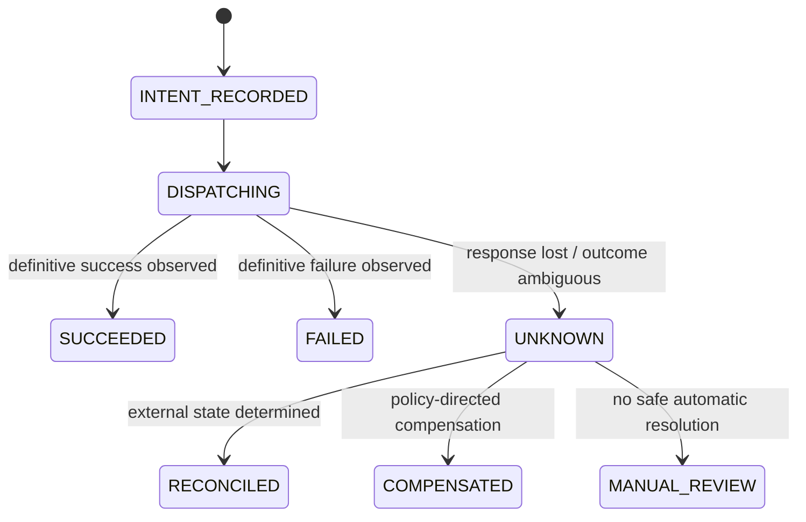

## 8. External side effects, idempotency, and the Side-Effect Ledger

This is one of the most important distributed-systems boundaries in the platform.

Consider:

```text
1. tool request reaches Slack
2. Slack commits the message
3. worker loses the response or crashes
4. workflow engine retries the Activity
```

The workflow engine cannot know from the network failure alone whether the external side effect occurred. Side-effecting Activities must therefore be designed to tolerate repeated execution or to enter an explicit reconciliation path.

### 8.1 Stable action identity

The runtime assigns a globally stable `tool_call_id` before execution. The trusted MCP/connector boundary persists the mutation intent before the downstream call.

The authoritative Side-Effect Ledger can store:

```text
(tenant_id, run_id, tool_call_id)
request_hash
tool
resource
idempotency_key
attempt
state
downstream_operation_id
response_hash
timestamps
```

The ledger should be ACID-capable because concurrent retries or duplicate submissions must not create multiple independent mutation intents for the same stable action identity.

### 8.2 Side-effect state machine



`UNKNOWN` is a first-class outcome. `PENDING` or `DISPATCHING` must not be interpreted automatically as safe to retry after an ambiguous network failure.

### 8.3 Downstream-specific retry semantics

If the downstream API supports idempotency keys, the connector should reuse the same stable key on every retry.

```http
Idempotency-Key: call_019283...
```

This provides the semantics offered by that downstream API. It should not be described generically as a two-phase commit or as a guarantee of exactly-once execution.

For APIs without idempotency support, the connector needs a tool-specific strategy:

- read-after-write reconciliation;
- externally visible operation IDs;
- compare-and-set semantics;
- deduplication in an intermediary system;
- compensation;
- human or operator reconciliation;
- or an explicit acceptance of at-least-once behavior.

The tool registry should advertise those semantics so harness developers and reviewers know what a retry can mean.

### 8.4 Evidence linkage

The Side-Effect Ledger and security evidence plane serve different purposes. The ledger is the authoritative operational record used to make retry and reconciliation decisions; the evidence plane preserves independently governed security evidence about the intent, authorization, approval, dispatch, and observed result.

---

