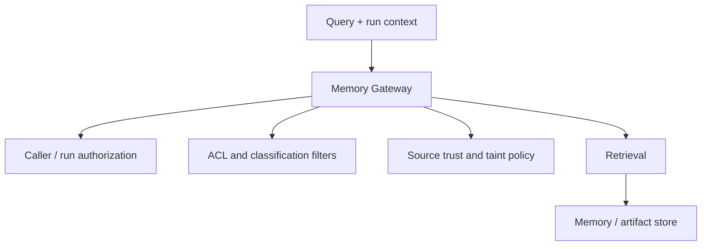

## 10. Content lineage, taint, and memory governance

Untrusted content can affect an agent within a single run and can also persist across runs. A malicious ticket, web page, document, tool result, or retrieved memory object can influence the model's next decision even when the content is not itself executable code.

The platform should therefore govern **artifacts**, not only long-term memory objects.

### 10.1 Artifact provenance and content trust

A governed artifact can record:

```json
{
  "artifact_id": "artifact_881a2",
  "payload_hash": "sha256:...",
  "source": "github://engineering/payments/issues/391",
  "source_type": "tool-output",
  "source_run_id": "run_991823ab",
  "ingesting_agent": "incident-investigator:v14",
  "initiating_principal": "alice@corp.example",
  "classification": "internal",
  "acl": ["group:engineering"],
  "source_trust": "external-untrusted",
  "taint": "high",
  "derived_from": [],
  "ingested_at": "2026-08-08T12:00:00Z"
}
```

A hash establishes content integrity relative to a known payload; it does not establish provenance by itself.

If cryptographically verifiable provenance is required, the ingestion service should sign or attest the metadata record, or anchor it in the audit/evidence system.

### 10.2 Conservative taint propagation

A default information-flow rule is:

\[
T_{derived} \ge \max(T_{input_1}, \ldots, T_{input_n})
\]

A model-generated summary of high-taint content is therefore still high-taint unless a trusted declassification operation lowers it.

Taint is not an authorization grant or denial by itself. It is policy input that can affect:

- context presentation and isolation;
- model guardrails;
- autonomous write eligibility;
- approval obligations;
- memory promotion eligibility;
- evidence requirements;
- whether derived content may cross trust or tenant boundaries.

### 10.3 Declassification is a privileged, action-bound transformation

Declassification is the deliberate lowering of an artifact's content-trust level. It must not be a general harness capability such as `mark_trusted()`.

A declassification record should bind the decision to specific input and output artifacts:

```json
{
  "declassification_id": "decl_01928",
  "input_artifact": "artifact_881",
  "input_hash": "sha256:...",
  "output_artifact": "artifact_992",
  "output_hash": "sha256:...",
  "from_taint": "high",
  "to_taint": "low",
  "method": "schema_extract",
  "policy": "content-declassification-v7",
  "reason": "extract invoice_number only",
  "run_id": "run_991823ab",
  "authorized_by": "policy:deterministic-extractor",
  "time": "2026-08-08T12:10:00Z"
}
```

The rule is:

> **Declassification authority applies to a specific transformation of specific content, not to arbitrary future artifacts.**

Two broad mechanisms are useful, with deterministic declassification preferred whenever the desired output can be expressed as a narrow structured transformation.

**Deterministic declassification is the primary automated path.** It may be permitted without human approval when a policy-approved, versioned transformation has tightly bounded semantics and cannot pass arbitrary free text through. Examples include extracting an ISO date, UUID, invoice number, enumerated status, or schema-validated JSON field using a strict parser, regular expression with bounded output, or JSON-schema-constrained extractor. The output must be materially narrower than the input and the transformation itself must be registered and evidenced.

This mechanism is intended to prevent cascading approval fatigue: an extended run should not require repeated human review merely to reuse small structured facts that can be deterministically isolated from high-taint context.

**Judgment-based declassification** is reserved for unstructured or semantic conclusions that cannot be established by a deterministic bounded transformation. It must be authorized by a principal holding a policy-defined declassification role (for example a designated data steward or security reviewer) or by a registered specialized review service with its own workload identity, narrow capability ceiling, and explicit declassification policy. The harness whose output is being reviewed cannot authorize its own declassification. Higher-impact trust-boundary changes may additionally require dual control.

The declassification event receives evidence treatment comparable to an approval because it changes future security decisions.

### 10.4 Authorization at retrieval time

Retrieval should pass through a Memory Gateway that applies current access policy before vector or keyword results are returned to the harness.



The vector database is an implementation detail rather than the security boundary.

### 10.5 Memory promotion is governed ingestion

Run-local state should not automatically become organization-wide memory.

Promotion to reusable memory can require policy based on:

- source and taint;
- data classification;
- owner;
- tenant;
- retention period;
- review status;
- allowed downstream purposes.

Deleting or quarantining the original source should also make it possible to identify derived memory through lineage so that affected artifacts can be re-evaluated, quarantined, or invalidated.

---

