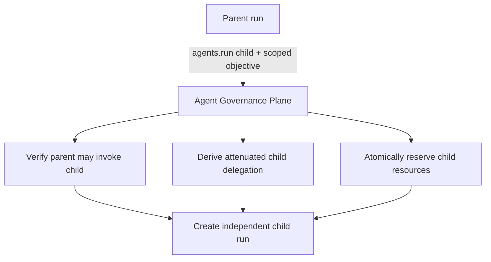

## 15. Subagent delegation

Subagents should use the same governed agent registry as top-level agents.

A parent harness requests a child run through the control plane:

The child gets its own:

- run ID;
- agent identity;
- workload identity;
- evidence stream;
- attenuated resource and capability bounds;
- tenant context inherited from trusted control-plane state unless explicit cross-tenant policy exists.

RFC 8693 allows nested `act` claims to describe a delegation chain, but the RFC does not define a cryptographically append-only multi-hop delegation proof. Each hop in this platform should therefore be authorized and re-issued by the trusted delegation service rather than allowing agents to edit their own actor chains.[4]

A useful capability invariant is:

\[
A_{child} \subseteq A_{parent}
\]

plus the child's own registered capability ceiling.

Resource allocation has a parallel invariant:

\[
B_{child,reserved} \le B_{parent,available}
\]

and delegation depth satisfies:

\[
D_{child}=D_{parent}+1 \le D_{max}
\]

When the child terminates, the authoritative Resource Allocation Service settles trusted usage and immediately credits unused reserved consumable capacity back to the parent's authoritative available pool. Propagation of the updated balance to execution-plane caches may be asynchronous, but no later sibling reservation should be forced to wait for a periodic cleanup job once terminal settlement has committed.

The A2A model in this document is intra-enterprise. Cross-organization agent-to-agent trust is a federation problem and is not implied by the nested actor representation.

---

