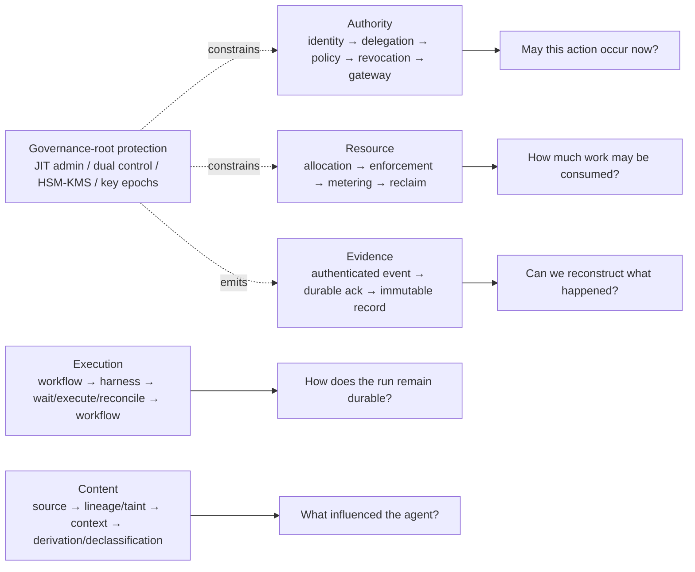

## Conclusion

The main components of an enterprise agent execution platform already have mature predecessors:

- OpenID Connect and OAuth for human authentication and API authorization;
- RFC 8693 for token exchange and actor/subject delegation semantics;
- OAuth Security BCP, mTLS, and DPoP for audience and sender constraints;
- SPIFFE/SPIRE or cloud workload identity for runtime processes;
- existing policy engines for authorization decisions;
- MCP for tool interfaces and enterprise-managed server authorization;
- Kubernetes for compute scheduling and isolation;
- Temporal or equivalent systems for durable workflow execution;
- OCI and Sigstore for artifact distribution and provenance;
- CloudEvents and immutable storage as components of an evidence pipeline.

What remains less standardized is the contract connecting those components into a vendor-neutral agent runtime.

A useful enterprise boundary is:

```text
Identity establishes who is involved.

Delegation establishes the maximum authority available.

Revocation determines whether that authority remains usable now.

The Resource Allocation Service establishes how much consumable capacity
may be reserved by a run and its descendants.

The Run Governor enforces the issued resource envelope.

The runtime keeps the run durable.

The harness proposes what happens next.

Content lineage describes what influenced that proposal and how trusted it is.

Gateways decide what may actually happen now.

The Side-Effect Ledger makes retries and ambiguous external outcomes explicit.

Sandboxes contain untrusted computation.

Signed artifacts establish which implementation, skills, and policy were loaded.

Protected governance administration and key custody constrain who can change
the trust root that issues authority, revocation, budgets, and declassifications.

The independent evidence plane records enough information to reconstruct
consequential side effects and governance decisions.
```

This arrangement permits models and harnesses to evolve independently of the organization's main security boundary.

The design can be summarized as five closed control loops, all resting on a cross-cutting governance-root protection layer:



That is the property an enterprise execution platform should preserve: **the harness remains replaceable, while authority, bounded execution, governed content, side effects, and evidence remain enforceable outside it.**

---

