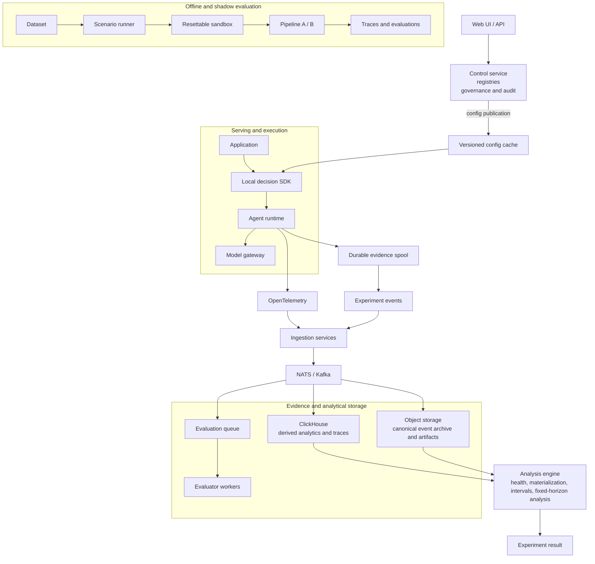

## 5. Reference architecture and separation of concerns

The architecture separates the serving-critical path from measurement and analysis.



### 5.1 Control plane

The control service owns:

```text
experiment definitions
pipeline manifests
dataset metadata
evaluator definitions
metric definitions
configuration publication
audit state
```

This state is low-volume and consistency-sensitive. PostgreSQL is a suitable default.

The control service can initially be a modular monolith.

The registries do not need separate network services merely because they are separate domain concepts.

### 5.2 Decision plane

Decisioning runs locally through an SDK or sidecar.

The control service publishes versioned configuration.

Applications evaluate:

```text
eligibility
pre-treatment trigger
enrollment
assignment
```

locally.

LinkedIn has documented deterministic hash-based local variant assignment as a way to achieve repeatability and avoid placing a remote assignment datastore in the serving path.

### 5.3 Evidence plane

OpenTelemetry records execution structure.

The experiment event stream records assignment, exposure, and outcome bookkeeping. Producers use a bounded durable local spool so new treatment execution is not admitted when core evidence cannot be retained. The canonical archive, event schemas, and versioned materialization rules make this evidence reproducible; ClickHouse remains a replaceable query projection.

These are separate logical data products even when they share transport or storage infrastructure.

### 5.4 Evaluation plane

Offline execution and model-based evaluation are asynchronous workloads.

They should scale independently from production ingestion.

### 5.5 Analysis plane

The analysis service builds experiment-unit datasets and computes experiment health and statistical results.

It does not infer experimental results directly from arbitrary trace rows.

The separation of experiment execution, log processing, analysis, and experiment management follows patterns documented in large-scale experimentation platforms such as Microsoft ExP.

---
