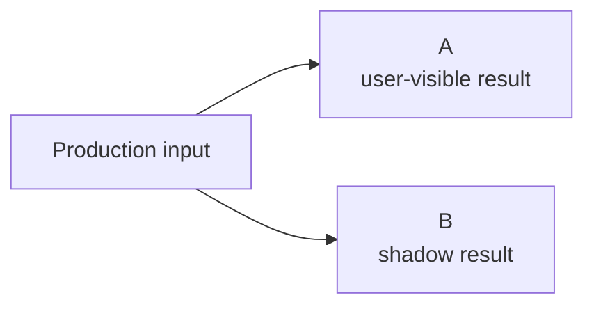

## 13. Shadow execution and rollout safety

Shadow execution runs a candidate asynchronously against copies of production inputs.



Variant B must not create production side effects. This includes state mutation, user contact, notifications, business events, analytics contamination, and writes to shared caches or memories.

Writes should be:

```text
blocked
redirected
or executed in an isolated environment
```

### 13.1 Purpose

Shadow execution measures candidate behavior under realistic input distributions.

Typical observations include:

```text
latency
cost
token usage
tool usage
fallback frequency
guardrail failures
trajectory length
model-based scores
deterministic validation
```

Statsig's current AI evaluation tooling also exposes shadow candidate evaluation against production traffic, reflecting the usefulness of this deployment stage in current AI experimentation workflows.

### 13.2 Statistical interpretation

Shadow execution is not an online controlled experiment.

Users do not receive B.

The system therefore cannot use shadow results to estimate effects such as:

```text
conversion
retention
user satisfaction
task completion caused by user interaction with B
```

Shadow data is operational and evaluative evidence.

### 13.3 Safety

Shadow pipelines should have:

```text
separate credentials
no production write credentials
deny-by-default network and tool access
read-only snapshots or replicas
trusted-gateway side-effect suppression
independent budgets
rate limits
separate caches and mutable state
execution.purpose = shadow
```

Suppression must be enforced by a trusted gateway or sandbox, not by asking the candidate agent to avoid side effects. A tool is unavailable to shadow execution if safe suppression cannot be enforced. Calls to external model providers still create billing, logging, and possible data-retention effects, so approved provider policy, egress controls, and separate quotas remain necessary.

Copied production inputs follow the same residency, minimization, redaction, retention, and access policies as the original request. Shadow execution should be sampled when running every production request twice would be prohibitively expensive.

---
