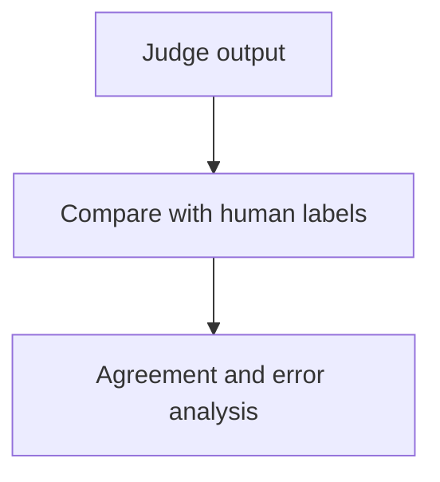

## 15. Evaluator architecture and calibration

The initial platform supports two automated evaluator classes:

```text
deterministic
model-based
```

Agentic evaluators are a later extension.

### 15.1 Deterministic evaluators

When the environment contains an objectively measurable result, deterministic checks are preferred.

Examples:

```text
refund_count == 1
ticket_status == resolved
JSON conforms to schema
database row exists
```

Process-contract checks can additionally verify that a required tool was invoked or a forbidden tool was avoided when the product contract truly specifies the path, rather than only the outcome. Latency and cost are measured operational variables, not deterministic evaluator results.

Objective checks are cheaper, reproducible, and usually easier to debug than asking another model to infer the outcome.

### 15.2 Model-based evaluators

Model-based evaluation applies to properties such as:

```text
helpfulness
clarity
tone
groundedness
explanation quality
instruction following
```

Every evaluator is versioned.

A definition contains:

```text
evaluator_id
evaluator_version
judge_model
judge_prompt
rubric
input contract
output contract
sampling parameters and seed when supported
```

Every emitted score retains that provenance.

Candidate content is untrusted input to the evaluator. The judge runs without tools or production credentials, receives candidate output in a clearly delimited data field, and uses an output schema that cannot be altered by instructions embedded in that content.

For comparative judgment, candidate labels are blinded and presentation order is randomized. Reports expose order-specific results and permit abstention when the rubric cannot support a reliable choice. These controls are part of the initial evaluator because unblinded or fixed-order judging can systematically favor a candidate.

### 15.3 Calibration

The platform maintains a human-labelled calibration dataset.

Periodically:



Calibration measures agreement, false-positive and false-negative rates, abstention, and uncertainty on representative slices. Aggregate agreement alone can hide poor performance on a safety-critical language, customer segment, or task class.

This prevents a change in evaluator implementation from being mistaken for a change in candidate quality.

Anthropic similarly recommends combining deterministic, model-based, and human assessment according to the property being measured rather than treating an LLM grader as an infallible oracle.

### 15.4 Evaluator changes

Changing:

```text
judge model
prompt
rubric
normalization
output interpretation
```

creates a new evaluator version.

Historical scores remain associated with the evaluator that produced them.

### 15.5 Post-MVP evaluator governance

Future versions can add:

```text
cross-evaluator audits
drift alerts
judge-family bias analysis
agentic judges
human review queues
```

The evaluator schema already supports these extensions.

---
